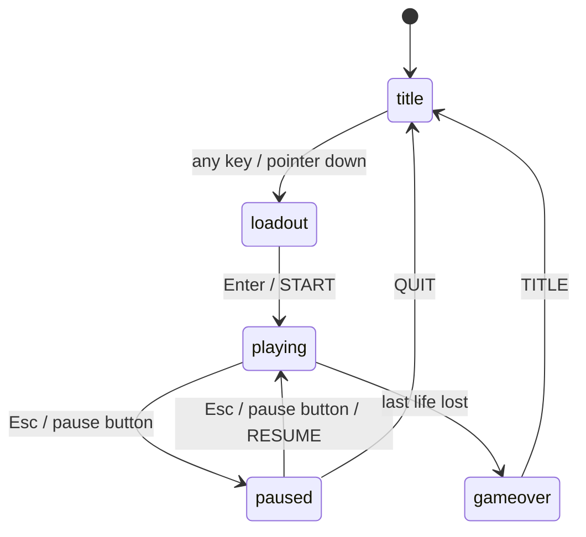
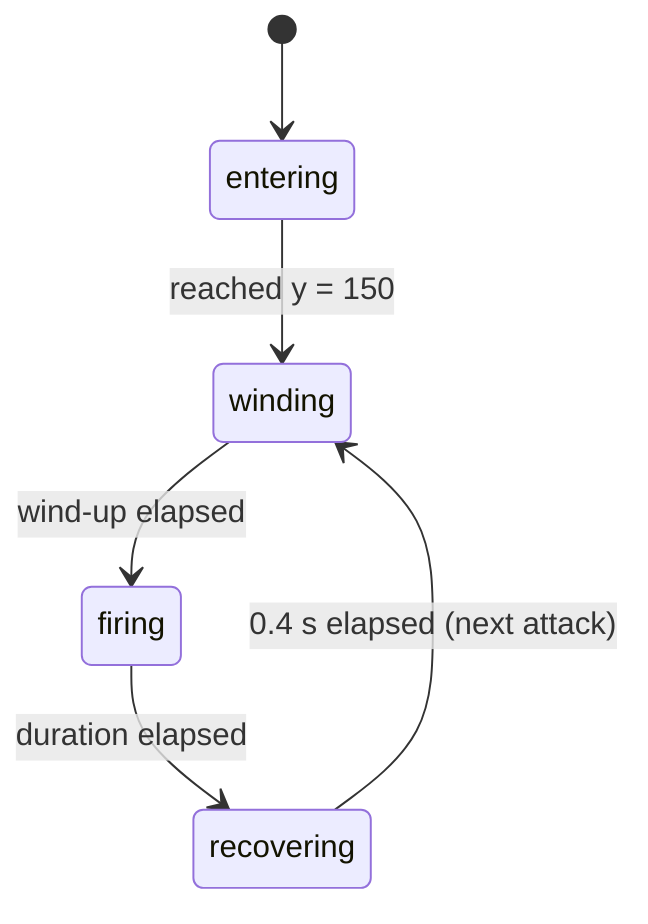

# SKY-1945 — Game Specification

This document describes everything a player can see, press and suffer in SKY-1945, as released on
2026-09-15, precisely enough to build the game so that it looks and plays the same.

It is the only reference. Do not read the existing game's source code, repository or built
JavaScript; the running game (§15) is for side-by-side comparison only.

## 0. Conventions

| Term | Meaning |
| --- | --- |
| **u** | World unit. The play field is 540 × 960 u. Inside the field, 1 u is 1 CSS px before the field is scaled to the screen. |
| **screen px** | CSS px outside the scaled field (HUD, touch stick, menus). |
| **Heading** | Degrees. 0° points right (+x), 90° points down the screen (+y); angles grow clockwise on screen. |
| **Box** | `top / left / width / height` of a part, relative to its parent frame, as CSS would read them. `%` is of the parent frame. In the drawings of §9 and §10 (aircraft parts, their pseudo-elements, bullets, beam, burst and speed-line pieces) everything is `position: absolute` unless stated otherwise. Menu and HUD tables state positioning explicitly; anything without it is in normal flow. |
| **Pseudo-element** | `::before` / `::after` always have `content: ""`. |
| **Polygon** | A CSS `clip-path: polygon(...)` point list, `x% y%` pairs in order. |
| **Paint order** | Listed bottom → top. Later items cover earlier ones. |
| **Pass** | One quarter of a simulated frame (see §13). |
| **s** | The boss's rolled size multiplier, 0.8–2.0 (see §12.9). |
| **m** | The current round's difficulty multiplier, 1.0–2.0 (see §12.5). |

Colours are written as CSS. `rgb(r g b / a%)` is CSS Color 4 notation.

---

## 1. Dependencies and constraints

### 1.1 Packages

Install exactly these versions.

| Package | Version | Kind |
| --- | --- | --- |
| `react` | 19.2.8 | runtime |
| `react-dom` | 19.2.8 | runtime |
| `matter-js` | 0.20.0 | runtime — collision detection (§12.11) |
| `vite` | 8.2.1 | build |
| `@vitejs/plugin-react` | 6.0.5 | build |
| `typescript` | 6.0.3 | build |
| `@types/matter-js` | 0.20.2 | types |
| `@types/react` | 19.2.18 | types |
| `@types/react-dom` | 19.2.4 | types |

Do **not** install `@kekkai/blueprint`.

### 1.2 Rendering constraint

No `<canvas>`, WebGL or SVG. Every aircraft, bullet, beam, effect and HUD element is an HTML
element styled with CSS (`clip-path`, gradients, shadows, filters, keyframe animations).
The visuals in this document are CSS values and only reproduce exactly as CSS.

### 1.3 Hosting

The production build may be served from a sub-path (e.g. `/sky-1945/`). Every asset URL — the
favicons in the document head and the title logo — must resolve under that base path.

### 1.4 What the game does not have

No sound, no score, no pickups, no saved progress, no network access, no background art.
No transition between screens — every screen change is an instant cut. No screen shake.
No hit feedback: an enemy aircraft looks exactly the same until the hit that destroys it, and the
boss shows damage only through its health bar.

---

## 2. Assets

These are the only image files. Everything else is drawn with CSS.

| File | Pixels | Bytes | Used for | Path (relative to the project root) |
| --- | --- | --- | --- | --- |
| `logo.webp` | 1024 × 596 | 219,970 | Title screen logo | `public/logo.webp` |
| `favicon.ico` | 16, 32, 48 | 15,086 | Browser tab icon | `public/favicon.ico` |
| `favicon-192.png` | 192 × 192 | 88,105 | High-DPI tab icon | `public/favicon-192.png` |

Serve all three as static files at the site root (under the base path).
No web fonts are loaded.

---

## 3. Document shell

### 3.1 HTML head

- `<html lang="en">`, `<meta charset="UTF-8">`
- Title: `尬電 1945`
- Icons, in this order:
  - `<link rel="icon" href="/favicon.ico" sizes="16x16 32x32 48x48">`
  - `<link rel="icon" type="image/png" sizes="192x192" href="/favicon-192.png">`
- Viewport: `width=device-width, initial-scale=1.0, viewport-fit=cover, user-scalable=no`
- One mount element, `<div id="root">`.

### 3.2 Global CSS

```css
*, *::before, *::after { box-sizing: border-box; }

html, body, #root {
  margin: 0;
  padding: 0;
  height: 100dvh;
  overflow: hidden;
}

body {
  background: #000;
  color: #fff;
  font-family: system-ui, sans-serif;
  padding: env(safe-area-inset-top) env(safe-area-inset-right)
           env(safe-area-inset-bottom) env(safe-area-inset-left);
  touch-action: none;
  overscroll-behavior: none;
  user-select: none;
  -webkit-user-select: none;
  -webkit-touch-callout: none;
  -webkit-tap-highlight-color: transparent;
}

#root { display: grid; place-items: center; }
```

Every screen fills `#root` (`width: 100%; height: 100%`).

### 3.3 Registered custom properties

Both are registered once for the whole document and must stay registered:

```css
@property --lean { syntax: '<number>'; inherits: true; initial-value: 0; }
@property --pace { syntax: '<number>'; inherits: true; initial-value: 1; }
```

Custom properties written at runtime:

| Property | Written on | Value |
| --- | --- | --- |
| `--stage-scale` | stage viewport | field fit scale (§8.1) |
| `--lean` | every entity's outer element | bank, −1…1, 3 decimals (§8.4) |
| `--pace` | speed-lines root | loadout speed multiplier (§10.5) |
| `--boss-scale` | boss craft frame | rolled size `s` (§9.7) |
| `--stick-x`, `--stick-y` | touch stick | touch-down point, screen px (§8.8) |
| `--knob-x`, `--knob-y` | touch stick | knob offset, screen px (§8.8) |

---

## 4. Design tokens

### 4.1 Neutrals and UI

| Token | Value | Used by |
| --- | --- | --- |
| Page background | `#000` | body |
| Page text | `#fff` | body, loadout heading |
| Field background | `#05070a` | play field |
| Field border | `#16202c` | play field |
| Muted label | `#7d8fa0` | round label, loadout hints, control table headers, "REACHED ROUND" |
| Soft label | `#9bb4c9` | title prompt, pause glyph |
| Bright label | `#dbe5f0` | overlay titles and buttons |
| Light surface | `#e8eef4` | START button, slider thumb, stat labels, control bindings |
| Dark ink | `#05080b` | START button text |
| Panel fill | `rgb(19 28 39 / 85%)` | pause button |
| Panel fill, strong | `rgb(19 28 39 / 90%)` | overlay buttons |
| Panel border | `#233040` | pause and overlay buttons |
| Overlay dim | `rgb(5 7 10 / 72%)` | pause / game-over overlay |
| Focus ring | `#4da3ff` | every focusable control |
| Stat track | `#1c242c` | loadout stat bars |
| Speed accent | `#4da3ff` | SPEED stat |
| Power accent | `#ff8c42` | POWER stat |
| Warning amber | `#ffb37a` | slow frame meter |

### 4.2 Ally (cold)

| Token | Value |
| --- | --- |
| Hull | `#131c27` |
| Face | `#33485f` |
| Face highlight | `#52708f` |
| Edge | `#4da3ff` |
| Glow | `#6ee7ff` |
| Canopy white | `#eafcff` |
| Canopy deep | `#14647f` |
| Wreck edge | `#2b6ba8` |

### 4.3 Enemy (red, deepening with size)

| Craft | Shell | Mid | Deep |
| --- | --- | --- | --- |
| ENEMY-S | `#ff8a5c` | `#a63f22` | `#8f3216` |
| ENEMY-M | `#ff4d4d` | `#7d1f1f` | `#6e1a1a` |
| ENEMY-L | `#b8322c` | `#5e1512` | `#4a100d` |

Enemy fire: `#fff3d0` → `#ffb03a` → `#d63a1a`, glow `rgb(255 138 60 / 55%)`.

### 4.4 Boss (near-black plate, violet energy)

| Token | Value |
| --- | --- |
| Plate | `#2b1524` |
| Plate lit | `#4a2440` |
| Edge | `#7d3f68` |
| Energy | `#c07dff` |
| Energy hot | `#f0d4ff` |
| Energy deep | `#6a2fa0` |

Violet is reserved for the boss, its beam and its health bar.

---

## 5. Screen flow



- Any event not on this diagram is ignored in that state (e.g. Esc during game over).
- `playing`, `paused` and `gameover` show the same stage. Pausing, resuming and game over reset nothing on it and restart none of its animations.
- Entering `playing` from the loadout always starts a fresh run: round 1, 3 lives, no enemies.
- The loadout allocation survives returning to the title and is offered again next run.
  It resets to the default (5) only on page reload.

---

## 6. Title screen

### 6.1 Layout

Full-screen flex column, `gap: 3rem`, centred on both axes, `cursor: pointer`.

| Element | Spec |
| --- | --- |
| `h1` | `margin: 0; line-height: 0`. Contains only the logo. |
| Logo `img` | `src` = base path + `logo.webp`, `alt="SKY-1945"`. `display: block; width: min(88vw, 32rem); height: auto`. |
| Prompt `p` | `margin: 0; font-size: clamp(0.75rem, 3.5vw, 1rem); letter-spacing: 0.28em; color: #9bb4c9`. Animation `breathe 2.4s ease-in-out infinite`. |

The prompt holds two spans, both always in the DOM:

| Text | Default | Under `(hover: none) and (pointer: coarse)` |
| --- | --- | --- |
| `PRESS ANY KEY` | shown | `display: none` |
| `TAP TO START` | `display: none` | `display: inline` |

### 6.2 Animation

| Name | Target | Keyframes | Duration | Easing | Iterations |
| --- | --- | --- | --- | --- | --- |
| breathe | prompt | `0%, 100% { opacity: 0.35 }` `50% { opacity: 1 }` | 2.4s | ease-in-out | infinite |

Reduced motion: no animation, `opacity: 0.8`.

### 6.3 Input

- Any `keydown` anywhere (any key, including modifiers and auto-repeat) → loadout.
- `pointerdown` anywhere on the screen → loadout.

---

## 7. Loadout screen

### 7.1 Layout

Flex column, `gap: 2rem`, centred, `width/height: 100%`, `padding: 2rem 1.5rem`. Children in order:

| # | Element | Spec |
| --- | --- | --- |
| 1 | `h1` `LOADOUT` | `margin: 0; font-size: clamp(1.5rem, 7vw, 2.5rem); font-weight: 700; letter-spacing: 0.12em` (colour inherited `#fff`) |
| 2 | `p` `10 POINTS · SPEND ONE, LOSE THE OTHER` | `margin: 0; font-size: 0.7rem; letter-spacing: 0.16em; color: #7d8fa0; text-align: center` |
| 3 | Stat column | flex column, `gap: 1rem; width: 100%; max-width: 22rem`. Two wrappers: SPEED (`color: #4da3ff`), then POWER (`color: #ff8c42`), each holding one stat bar (§7.2). |
| 4 | Slider row | flex, `gap: 0.75rem; align-items: center; width: 100%; max-width: 22rem`: span `POWER`, range input, span `SPEED` (§7.3). |
| 5 | Controls table wrapper | `width: 100%; max-width: 22rem` (§7.4) |
| 6 | `button` `START` | `padding: 0.75rem 3rem; font: inherit; font-size: 0.8rem; letter-spacing: 0.24em; color: #05080b; background: #e8eef4; border: none; border-radius: 999px; cursor: pointer`. Focus-visible: `outline: 2px solid #4da3ff; outline-offset: 0.25rem`. |

### 7.2 Stat bar

Grid `grid-template-columns: 5rem 1fr 3.5rem; gap: 0.75rem; align-items: center; width: 100%`. The hue comes from the wrapper's `color`.

| Part | Element | Spec |
| --- | --- | --- |
| Label | span | `SPEED` / `POWER`. `font-size: 0.7rem; letter-spacing: 0.18em; color: #e8eef4` |
| Track | div | `overflow: hidden; height: 0.5rem; background: #1c242c; border-radius: 999px` |
| Fill | div in track | `width: 100%; height: 100%; background: currentColor; transform-origin: left center; transform: scaleX(f); transition: transform 120ms ease-out` where `f = (percent − 100) / 100` |
| Value | span | `{percent}%`. `font-size: 0.75rem; font-variant-numeric: tabular-nums; text-align: right; color: currentColor` |

Reduced motion: no transition.

### 7.3 Slider

Native `<input type="range" min="0" max="10" step="1">`, value = points on speed,
`aria-label="Points spent on speed"`. Left end label `POWER`, right end `SPEED`
(`font-size: 0.6rem; letter-spacing: 0.14em; color: #7d8fa0`).

| Part | Spec |
| --- | --- |
| Input | `flex: 1; height: 1.75rem; background: transparent; cursor: pointer; appearance: none` |
| Track (WebKit and Firefox) | `height: 0.25rem; background: linear-gradient(90deg, #ff8c42, #4da3ff); border-radius: 999px` |
| Thumb (WebKit and Firefox) | `width/height: 1.25rem; background: #e8eef4; border: none; border-radius: 50%`; WebKit also `margin-top: -0.5rem; appearance: none` |
| Focus-visible | `outline: 2px solid #4da3ff; outline-offset: 0.5rem` |

### 7.4 Controls table

`<table>`: `width: 100%; font-size: 0.65rem; letter-spacing: 0.12em; border-collapse: collapse`.

- `<caption>` `CONTROLS`: `padding-bottom: 0.6rem; font-size: 0.6rem; letter-spacing: 0.2em; color: #7d8fa0`.
- Header row: an empty `td`, then `th scope="col"` `KEYS`, `TOUCH`.
- Body rows: `th scope="row"` action, then two `td` bindings.

| Action | KEYS | TOUCH |
| --- | --- | --- |
| STEER | ARROW KEYS | DRAG ANYWHERE |
| ROLL | SPACE | TAP OR 2ND FINGER |
| PAUSE | ESC | ❚❚ BUTTON |

Header cells (`KEYS`, `TOUCH`, action names): `font-weight: 400; color: #7d8fa0; text-align: left`; action cells add `padding-right: 1rem`.
Binding cells: `padding: 0.25rem 1rem 0.25rem 0; color: #e8eef4; text-align: left`.

### 7.5 Allocation rules

- 10 points shared between two stats. The slider value is the points on SPEED; POWER gets the rest.
- Each point is 10%. A stat with 0 points is 100%; with 10 points it is 200%.
- Default: 5 points (150% / 150%).
- Multiplier = percent / 100. See §14.1 for the full table.

### 7.6 Input

| Input | Effect |
| --- | --- |
| ArrowLeft | −1 point on speed (clamped to 0–10), default prevented |
| ArrowRight | +1 point on speed (clamped), default prevented |
| Enter | start the run, default prevented |
| Dragging / clicking the slider | set points (rounded, clamped) |
| START button | start the run |

---

## 8. Stage

### 8.1 Viewport and field

| Element | Spec |
| --- | --- |
| Viewport | `position: relative; width: 100%; height: 100%; overflow: hidden` |
| Field | `position: absolute; top: 50%; left: 50%; width: 540px; height: 960px; background: #05070a; border: 1px solid #16202c; transform-origin: 0 0; transform: scale(var(--stage-scale, 1)) translate(-50%, -50%)` |

- `--stage-scale = min(viewportWidth / 540, viewportHeight / 960)`, from the viewport's content box,
  updated whenever the viewport's size changes.
- The field is the same 540 × 960 u on every device. The screen fits the field, never the other way round.
- The field's own box includes its 1px border. Entities are positioned from the inner (padding) corner.
- **The field does not clip.** Anything outside it stays visible wherever the viewport has room
  (enemies flying in, bullets past the edges, the aircraft re-entering from below).
  Only the viewport clips. Speed lines are the exception: they clip to the field.

### 8.2 Stage paint order

Children of the viewport, bottom → top as painted:

1. Field — speed lines, then every entity (§8.3)
2. Touch surface — `position: absolute; inset: 0; touch-action: none` (transparent; catches pointer input over the whole viewport, margins included — except where the pause button is, and except while an overlay covers it)
3. Touch stick (§8.8)
4. Overlay (`z-index: 1`), only while paused or game over (§8.7)
5. HUD (`z-index: 2`) (§8.5)

The HUD sits above the overlay: the pause button stays visible and usable while paused.

### 8.3 Entity paint order inside the field

After the speed lines, entities are laid out in this order, each group in order of creation:

1. The player's aircraft
2. Bullets — player and enemy fire mixed, oldest first
3. Enemy aircraft, oldest first
4. The boss
5. The beam
6. Bursts, oldest first

So bullets cover the player, enemy aircraft cover bullets, the beam covers the boss, and bursts cover everything.

### 8.4 Placing an entity

Every entity has an outer element, `position: absolute; top: 0; left: 0`, with negative margins that
centre its box on the field's (0, 0). Once per displayed frame, the outer element receives:

```
transform: translate3d(<x>px, <y>px, 0) rotate(<angle>deg)
--lean: <lean, 3 decimals>
```

- `x, y` are the entity's centre in u.
- `angle`: 0 for the player, bullets, beam and bursts; **180 for every enemy aircraft and the boss**.
  Enemies are drawn nose-up and turned over by this angle.
- **Lean** (banking), computed per entity, per displayed frame:

  ```
  slide  = x − previousX            // 0 on the first frame
  target = clamp(slide / 4, −1, 1)  // 4 u of sideways travel in one frame = full lean
  lean   = lean + (target − lean) × 0.18
  ```

  Lean is per displayed frame, not per second: a high-refresh screen eases faster and
  sees smaller per-frame slides.

### 8.5 HUD

A frame sized exactly like the scaled field but not itself scaled, so its contents keep their screen size:

`position: absolute; top: 50%; left: 50%; z-index: 2; width: calc(540px * var(--stage-scale, 1)); height: calc(960px * var(--stage-scale, 1)); transform: translate(-50%, -50%); pointer-events: none`.

Its children are all `position: absolute`, in this order (later ones paint on top):

| Element | Position | Spec |
| --- | --- | --- |
| Lives | top-left: `top: 0.85rem; left: 0.85rem` | Flex row, `gap: 0.3rem`, one life icon (§9.2) per remaining life |
| Round `p` | top-centre: `top: 0.9rem; left: 50%; transform: translateX(-50%)` | Text `ROUND {n}`. `margin: 0; font-size: 0.65rem; letter-spacing: 0.24em; color: #7d8fa0` |
| Boss health bar | §8.6 | Only while a boss exists |
| Frame meter `p` | bottom-left: `bottom: 0.7rem; left: 0.85rem` | §8.9 |
| Pause `button` | top-right: `top: 0.75rem; right: 0.75rem` | §8.5.1. Hidden during game over |

#### 8.5.1 Pause button

`pointer-events: auto; display: grid; place-items: center; width: 2.25rem; height: 2.25rem; font-size: 0.7rem; line-height: 1; color: #9bb4c9; background: rgb(19 28 39 / 85%); border: 1px solid #233040; border-radius: 50%; cursor: pointer`.
No font family is set — it keeps the browser's default button font.
Focus-visible: `outline: 2px solid #4da3ff; outline-offset: 2px`.

| Phase | Glyph | `aria-label` |
| --- | --- | --- |
| playing | `❚❚` (U+275A twice) | Pause |
| paused | `▶` (U+25B6) | Resume |

### 8.6 Boss health bar

| Part | Element | Spec |
| --- | --- | --- |
| Wrap | div | `position: absolute; top: 2.6rem; left: 50%; display: flex; flex-direction: column; align-items: center; width: 68%; transform: translateX(-50%)` |
| Track | div | `width: 100%; height: 8px; background: rgb(20 10 18 / 85%); border: 1px solid #7d3f68; border-radius: 1px; box-shadow: 0 0 8px rgb(0 0 0 / 60%)`. `role="progressbar"`, `aria-valuemin=0`, `aria-valuemax=maxHp`, `aria-valuenow=max(hp, 0)`, `aria-label` = `Boss health` or `Boss health, shielded`. |
| Fill | div in track | `height: 100%; width: {fraction × 100}%; background: linear-gradient(90deg, #6a2fa0 0%, #c07dff 55%, #f0d4ff 100%); transition: width 0.09s linear`. `fraction = clamp(hp / maxHp, 0, 1)` (0 if `maxHp ≤ 0`). |
| Note `p` | under track | `ARRIVING`, while shielded. `margin-top: 0.35rem; color: #9dc3e6; font-size: 0.66rem; font-weight: 700; letter-spacing: 0.24em; text-shadow: 0 0 8px rgb(61 95 125 / 80%)` |
| Warning `p` | under track | `ROLL`, while the boss winds up a beam. `margin-top: 0.35rem; color: #f0d4ff; font-size: 0.72rem; font-weight: 700; letter-spacing: 0.28em; text-shadow: 0 0 10px #c07dff`. Animation `urge 0.35s ease-in-out infinite alternate`. |

Both text lines are `p` elements and keep the browser's default bottom margin.

| State | When | Track | Fill |
| --- | --- | --- | --- |
| Normal | boss fighting, fraction > 0.25 | as above | as above |
| Low | not shielded and fraction ≤ 0.25 | `border-color: #ff5c8a` | `background: linear-gradient(90deg, #ff5c8a 0%, #ffb37a 100%)` |
| Shielded | boss still flying in | `border-color: #4a6a8a; border-style: dashed` | `background: repeating-linear-gradient(115deg, #3d5f7d 0 6px, rgb(20 10 18 / 90%) 6px 12px)`; animation `sweep 0.6s linear infinite` |

| Name | Keyframes |
| --- | --- |
| sweep | `background-position: 0 0` → `26px 0` |
| urge | `opacity: 0.55` → `1` |

Reduced motion: no width transition; `ROLL` holds at `opacity: 1`; the hatching stays but stops travelling.

### 8.7 Overlays

`position: absolute; inset: 0; z-index: 1; display: flex; flex-direction: column; gap: 2rem; align-items: center; justify-content: center; background: rgb(5 7 10 / 72%)`.

| Overlay | Content, in order |
| --- | --- |
| Paused | title `PAUSED`; actions `RESUME`, `QUIT` |
| Game over | title `GAME OVER`; `REACHED ROUND {n}`; actions `TITLE` |

| Part | Spec |
| --- | --- |
| Title `p` | `margin: 0; font-size: 0.85rem; letter-spacing: 0.3em; color: #dbe5f0` |
| Reached `p` | `margin: -1.25rem 0 0; font-size: 0.6rem; letter-spacing: 0.22em; color: #7d8fa0` |
| Action row | flex, `gap: 0.75rem` |
| Action `button` | `padding: 0.6rem 1.75rem; font: inherit; font-size: 0.7rem; letter-spacing: 0.2em; color: #dbe5f0; background: rgb(19 28 39 / 90%); border: 1px solid #233040; border-radius: 999px; cursor: pointer`. Focus-visible: `outline: 2px solid #4da3ff; outline-offset: 2px` |

`RESUME` resumes, `QUIT` goes to the title, `TITLE` goes to the title.

### 8.8 Touch stick

Positioned in screen px, never scaled.

| Part | Spec |
| --- | --- |
| Ring | `position: fixed; top: 0; left: 0; width: 52px; height: 52px; margin-top: -26px; margin-left: -26px; border: 1.5px solid rgb(110 231 255 / 35%); border-radius: 50%; opacity: 0; transform: translate3d(var(--stick-x, -200px), var(--stick-y, -200px), 0); pointer-events: none; transition: opacity 120ms ease-out` |
| Knob | `position: absolute; top: 50%; left: 50%; width: 44px; height: 44px; margin-top: -22px; margin-left: -22px; background: rgb(110 231 255 / 65%); border-radius: 50%; transform: translate3d(var(--knob-x, 0), var(--knob-y, 0), 0)` |

Behaviour (see §12.3 for what the touch does to the aircraft):

- Touch down: ring moves to the touch point, knob centred, ring opacity 1.
- Move: knob offset = finger offset, capped to a length of 26 px (`round(22 × 1.2)`). The knob follows even inside the dead zone.
- Release / cancel: knob centred, ring opacity 0.
- Reduced motion: no opacity transition.

### 8.9 Frame meter

`p`: `position: absolute; bottom: 0.7rem; left: 0.85rem; color: rgb(150 215 255 / 45%); font-size: 0.62rem; font-family: ui-monospace, SFMono-Regular, Menlo, monospace; font-variant-numeric: tabular-nums; letter-spacing: 0.08em; pointer-events: none`.
It keeps the browser's default paragraph margins.

| Reading | Text | Style |
| --- | --- | --- |
| fps = 0 | `—` (U+2014) | normal |
| fps ≥ 55 | `{fps} FPS · {worst}ms` (U+00B7) | normal |
| 0 < fps < 55 | same | `color: #ffb37a; text-shadow: 0 0 8px rgb(255 179 122 / 45%)` |

`fps = 0` covers both "nothing measured yet" and a window whose rate rounds to 0 — a single frame of 2 s or longer, e.g. returning from a background tab, brings `—` back mid-run.

How it is measured is in §13.3.

---

## 9. Aircraft

### 9.1 ALLY-01 — the player

**Frame** 44 × 52 u, centred on the aircraft's position. Hit circle radius 3 (§12.11) — deliberately
tiny against the drawing.

**Layer tree**

```
Mount     44×52, margin-top −26, margin-left −22, will-change: transform, perspective: 320px
└─ Craft  fills mount, position: relative, transform-style: preserve-3d,
          transform: rotate(calc(var(--lean, 0) * 14deg))
   ├─ Thrust
   ├─ Wing        (+ ::before leading-edge glow, + ::after wingtip lamps)
   ├─ Fin left
   ├─ Fin right
   ├─ Body        (+ ::before spine line)
   └─ Canopy
```

All Craft children are `position: absolute`. Craft tokens: `--hull: #131c27; --face: #33485f; --edge: #4da3ff; --glow: #6ee7ff`.

**Parts** (paint order)

| Layer | Box | Shape | Fill | Effects |
| --- | --- | --- | --- | --- |
| Thrust | `bottom: -4%; left: 28%; width: 44%; height: 20%` | rectangle | `radial-gradient(ellipse 55% 100% at 30% 0%, var(--glow) 0%, transparent 70%), radial-gradient(ellipse 55% 100% at 70% 0%, var(--glow) 0%, transparent 70%)` | `opacity: 0.85; filter: blur(1.5px); transform-origin: 50% 0%; will-change: transform`; animation `burn` |
| Wing | `42% / 0 / 100% / 36%` | polygon `0% 86%, 16% 6%, 40% 0%, 60% 0%, 84% 6%, 100% 86%, 100% 100%, 68% 62%, 32% 62%, 0% 100%` | `linear-gradient(180deg, var(--face) 0%, var(--hull) 55%)` | |
| Wing ::before | `inset: 0` | `clip-path: inherit` | `linear-gradient(180deg, var(--glow) 0%, transparent 26%)` | |
| Wing ::after | `inset: 0` | — (clipped by the wing) | `radial-gradient(circle 1.5px at 2% 84%, var(--glow) 0%, transparent 100%), radial-gradient(circle 1.5px at 98% 84%, var(--glow) 0%, transparent 100%)` | |
| Fin left | `bottom: 2%; left: 10%; width: 22%; height: 26%` | polygon `100% 0%, 100% 100%, 0% 100%` | `linear-gradient(180deg, var(--face), var(--hull))` | |
| Fin right | `bottom: 2%; right: 10%; width: 22%; height: 26%` | polygon `0% 0%, 100% 100%, 0% 100%` | same | |
| Body | `0 / 33% / 34% / 100%` | polygon `50% 0%, 74% 20%, 66% 48%, 76% 74%, 62% 100%, 38% 100%, 24% 74%, 34% 48%, 26% 20%` | `linear-gradient(90deg, var(--hull) 0%, var(--face) 34%, #52708f 50%, var(--face) 66%, var(--hull) 100%)` | |
| Body ::before | `34% / 46% / 8% / 52%` | rectangle | `linear-gradient(180deg, var(--edge), transparent)` | `opacity: 0.9` |
| Canopy | `20% / 39% / 22% / 22%` | `border-radius: 52% 52% 40% 40%` | `linear-gradient(155deg, #eafcff 0%, var(--glow) 42%, #14647f 100%)` | `box-shadow: 0 0 5px var(--glow)` |

**States**

| State | When | Visual |
| --- | --- | --- |
| Protected | invulnerable (§12.3) | Craft animation `protected 260ms ease-in-out infinite alternate` |
| Rolling | during a barrel roll — always also protected | Craft animation `roll 1.2s linear, protected 260ms ease-in-out infinite alternate`. The spin replaces the bank while it runs. |
| Spent | from a roll's start until the next roll is allowed (2.4 s) | Thrust gets `opacity: 0.35; filter: saturate(0.4)`. The filter **replaces** the blur (sharp, desaturated plume). The `burn` animation keeps driving opacity, so 0.35 only shows when `burn` is off (reduced motion). |

**Animations**

| Name | Target | From | To | Duration | Easing | Iterations |
| --- | --- | --- | --- | --- | --- | --- |
| burn | Thrust | `transform: scaleY(0.78); opacity: 0.72` | `transform: scaleY(1.28); opacity: 0.95` | 90ms | ease-in-out | infinite alternate |
| roll | Craft | `transform: rotateY(0deg)` | `transform: rotateY(1080deg)` | 1.2s | linear | 1 (starts when the roll starts) |
| protected | Craft | `opacity: 1` | `opacity: 0.35` | 260ms | ease-in-out | infinite alternate |

**Reduced motion**

- Thrust: `animation: none; transform: scaleY(1.03)`.
- A rule sets rolling to `animation: none; filter: brightness(1.6)`. Because a rolling aircraft is always
  also protected, the combined rolling + protected rule is more specific and wins the `animation`
  declaration: **the spin and the blink still play**, and the aircraft is additionally brightened ×1.6.

### 9.2 Life icon

ALLY-01 reduced to two parts, 14 × 16 px (HUD, not scaled).

| Layer | Box | Shape | Fill |
| --- | --- | --- | --- |
| Icon | `span`, `position: relative; display: inline-block; width: 14px; height: 16px` | — | — |
| Wing | `42% / 0 / 100% / 34%` | polygon `0% 86%, 18% 0%, 82% 0%, 100% 86%, 100% 100%, 66% 62%, 34% 62%, 0% 100%` | `#33485f` |
| Body | `0 / 34% / 32% / 100%` | polygon `50% 0%, 100% 24%, 100% 88%, 62% 100%, 38% 100%, 0% 88%, 0% 24%` | `linear-gradient(180deg, #6ee7ff 0%, #4da3ff 40%, #16202c 100%)` |

### 9.3 Enemy aircraft — common layers

All three enemy craft use the same two-level frame:

```
Mount     position: absolute; top: 0; left: 0; will-change: transform
          frame size, margins and colour tokens as given for each craft; transform angle 180°
└─ Craft  position: absolute; inset: 0; transform: rotate(calc(var(--lean, 0) * -14deg))
   └─ parts (position: absolute)
```

The bank is negated because the whole drawing is turned 180°; on screen the nose still leans into the turn, like the player's.
Each craft sets `--shell`, `--mid`, `--deep` (§4.3) on its Mount. Enemies have no states and no animations of their own.

### 9.4 ENEMY-S

Frame **34 × 36 u**, `margin-top: -18px; margin-left: -17px`. Hit radius 13.

| Layer | Box | Shape | Fill | Effects |
| --- | --- | --- | --- | --- |
| Wing | `34% / 0 / 100% / 42%` | polygon `0% 0%, 100% 0%, 78% 100%, 22% 100%` | `linear-gradient(180deg, var(--shell) 0%, var(--mid) 100%)` | |
| Body | `0 / 32% / 36% / 82%` | polygon `50% 0%, 100% 46%, 82% 100%, 18% 100%, 0% 46%` | `linear-gradient(180deg, #ffc7a8 0%, var(--shell) 55%, var(--deep) 100%)` | |
| Core | `44% / 42% / 16% / 16%` | `border-radius: 50%` | `#ffe9c9` | `box-shadow: 0 0 6px #ffb37a` |

### 9.5 ENEMY-M

Frame **54 × 56 u**, `margin-top: -28px; margin-left: -27px`. Hit radius 20.

| Layer | Box | Shape | Fill | Effects |
| --- | --- | --- | --- | --- |
| Wing | `30% / 0 / 100% / 44%` | polygon `0% 14%, 20% 0%, 80% 0%, 100% 14%, 100% 74%, 62% 100%, 38% 100%, 0% 74%` | `linear-gradient(180deg, var(--shell) 0%, var(--mid) 100%)` | |
| Pod left | `top: 44%; left: 8%; width: 15%; height: 40%` | `border-radius: 2px 2px 40% 40%` | `linear-gradient(180deg, #9c2b2b, #4d1414)` | |
| Pod right | `top: 44%; right: 8%; width: 15%; height: 40%` | same | same | |
| Body | `0 / 34% / 32% / 100%` | polygon `50% 0%, 100% 28%, 100% 84%, 66% 100%, 34% 100%, 0% 84%, 0% 28%` | `linear-gradient(180deg, #ffb0b0 0%, var(--shell) 48%, var(--deep) 100%)` | |
| Canopy | `22% / 42% / 16% / 18%` | `border-radius: 50%` | `#2a0d0d` | |

### 9.6 ENEMY-L

Frame **86 × 78 u**, `margin-top: -39px; margin-left: -43px`. Hit radius 32.

| Layer | Box | Shape | Fill | Effects |
| --- | --- | --- | --- | --- |
| Wing | `26% / 0 / 100% / 46%` | polygon `0% 20%, 14% 0%, 86% 0%, 100% 20%, 100% 100%, 72% 82%, 28% 82%, 0% 100%` | `linear-gradient(180deg, var(--shell) 0%, var(--mid) 100%)` | |
| Armour | `40% / 12% / 76% / 16%` | rectangle | `repeating-linear-gradient(90deg, #7d211d 0 6px, #521310 6px 8px)` | |
| Pod left | `top: 56%; left: 8%; width: 11%; height: 34%` | `border-radius: 2px 2px 45% 45%` | `linear-gradient(180deg, #8f2723, #38100e)` | |
| Pod right | `top: 56%; right: 8%; width: 11%; height: 34%` | same | same | |
| Body | `0 / 36% / 28% / 100%` | polygon `50% 0%, 100% 22%, 100% 86%, 70% 100%, 30% 100%, 0% 86%, 0% 22%` | `linear-gradient(180deg, #f0a9a4 0%, var(--shell) 40%, var(--deep) 100%)` | |
| Core | `30% / 44% / 12% / 12%` | `border-radius: 50%` | `#ffdca8` | `box-shadow: 0 0 8px #ff8a5c` |

### 9.7 BOSS

Frame **140 × 124 u** at size 1, drawn nose-up and turned 180°. Every boss is rolled a random size `s`
when it appears (§12.9.1); the size changes both the drawing and the fight.

**Layer tree**

```
Mount          140×124, margin-top −62, margin-left −70, will-change: transform
│              tokens --plate #2b1524, --plate-lit #4a2440, --edge #7d3f68,
│                     --energy #c07dff, --energy-hot #f0d4ff
│              attributes: data-pose = entering | winding | firing | recovering
│                          data-move = straight | spread | radial | beam | ram   (absent while entering)
├─ Charge line (not scaled)
└─ Craft       position: absolute; inset: 0; transform-origin: 50% 50%;
               scale: var(--boss-scale, 1)            ← the rolled size s
               transform: rotate(calc(var(--lean, 0) * -9deg))
   ├─ Wing
   ├─ Arm left
   ├─ Arm right
   ├─ Armour
   ├─ Pod left
   ├─ Pod right
   ├─ Body
   ├─ Spine
   ├─ Canopy
   ├─ Core
   └─ Muzzle
```

`scale` is the individual CSS property, so it composes with `transform` instead of replacing it.
The bank is shallower (9°) than the other enemies' because the silhouette is wide.

**Parts** (all `position: absolute`, boxes relative to the 140 × 124 frame before scaling)

| Layer | Box | Shape | Fill | Effects |
| --- | --- | --- | --- | --- |
| Wing | `22% / 0 / 100% / 52%` | polygon `0% 26%, 10% 0%, 90% 0%, 100% 26%, 100% 100%, 74% 78%, 26% 78%, 0% 100%` | `linear-gradient(180deg, var(--plate-lit) 0%, var(--plate) 100%)` | |
| Arm left | `top: 8%; left: 2%; width: 16%; height: 44%` | polygon `0% 30%, 100% 0%, 100% 100%, 20% 82%` | `linear-gradient(180deg, var(--edge) 0%, var(--plate) 90%)` | |
| Arm right | `top: 8%; right: 2%; width: 16%; height: 44%` | polygon `0% 0%, 100% 30%, 80% 82%, 0% 100%` | same | |
| Armour | `44% / 10% / 80% / 13%` | rectangle | `repeating-linear-gradient(90deg, #57274a 0 7px, #24101f 7px 10px)` | |
| Pod left | `top: 58%; left: 14%; width: 10%; height: 32%` | `border-radius: 2px 2px 45% 45%` | `linear-gradient(180deg, #4a2440, #180a15)` | |
| Pod right | `top: 58%; right: 14%; width: 10%; height: 32%` | same | same | |
| Body | `0 / 37% / 26% / 100%` | polygon `50% 0%, 100% 20%, 100% 86%, 68% 100%, 32% 100%, 0% 86%, 0% 20%` | `linear-gradient(180deg, #b98fae 0%, var(--plate-lit) 38%, #150a13 100%)` | |
| Spine | `12% / 49% / 2% / 62%` | rectangle | `linear-gradient(180deg, var(--energy) 0%, transparent 100%)` | `opacity: 0.75` |
| Canopy | `16% / 45% / 10% / 12%` | `border-radius: 50%` | `#120810` | |
| Core | `34% / 43% / 14% / 14%` | `border-radius: 50%` | `radial-gradient(circle, var(--energy-hot) 0%, var(--energy) 60%, #6a2fa0 100%)` | `box-shadow: 0 0 10px var(--energy)` |
| Muzzle | `-2% / 44% / 12% / 8%` | `border-radius: 50% 50% 0 0` | `#120810` | `box-shadow: inset 0 -2px 4px #000` |

**Charge line** — a child of the Mount (so it is not scaled), painted under the Craft:

`position: absolute; bottom: 100%; left: 50%; width: 2px; height: 900px; background: linear-gradient(180deg, rgb(192 125 255 / 10%) 0%, var(--energy-hot) 100%); opacity: 0; transform: translateX(-50%)`.

In the un-rotated drawing it rises 900 u above the top (nose) edge; turned 180° on screen, it hangs 900 u
**down** from the boss, bright at the boss and fading away. It starts at the unscaled frame edge, 62 u
from the boss's centre, whatever `s` is.

**Tells** — how pose and move change the drawing

| Condition | Changes |
| --- | --- |
| entering | none (Core has no animation) |
| winding, any move | Core: animation `charge 0.4s ease-in-out infinite alternate`. Spine: `opacity: 1`. |
| winding + beam | also Charge line: animation `aim 1.4s ease-in forwards`. Muzzle: `background: var(--energy); box-shadow: 0 0 18px var(--energy-hot)`. |
| firing, any move | Pods: `background: linear-gradient(180deg, var(--energy) 0%, #4a2440 70%); box-shadow: 0 0 12px var(--energy)`. Core: `box-shadow: 0 0 20px var(--energy-hot)`. |
| firing + beam | also Muzzle: `background: var(--energy-hot); box-shadow: 0 0 30px var(--energy-hot)`. |
| recovering | none (Core has no animation) |

When the pose leaves `winding`, the charge line returns to `opacity: 0` at once.

**Animations**

| Name | Target | From | To | Duration | Easing | Iterations / fill |
| --- | --- | --- | --- | --- | --- | --- |
| charge | Core | `box-shadow: 0 0 10px var(--energy); transform: scale(1)` | `box-shadow: 0 0 26px var(--energy-hot); transform: scale(1.5)` | 0.4s | ease-in-out | infinite alternate |
| aim | Charge line | `width: 2px; opacity: 0.35` | `width: 14px; opacity: 0.9` | 1.4s | ease-in | 1, forwards |

**Reduced motion** — the tells become held states instead of disappearing:

- winding Core: `animation: none; box-shadow: 0 0 26px var(--energy-hot); transform: scale(1.4)`.
- winding + beam Charge line: `animation: none; width: 14px; opacity: 0.9`.

**What the rolled size changes on screen**

| Geometry | Formula | s = 0.8 | s = 1 | s = 2 |
| --- | --- | --- | --- | --- |
| Drawing width × height (u) | 140s × 124s | 112 × 99.2 | 140 × 124 | 280 × 248 |
| Nose distance from centre | 62s | 49.6 | 62 | 124 |
| Hit circle radius | 52s | 41.6 | 52 | 104 |
| Muzzle point below centre (bullets, beam top) | 66s | 52.8 | 66 | 132 |
| Charge line start below centre | 62 (fixed) | 62 | 62 | 62 |
| Beam width | 88 (fixed) | 88 | 88 | 88 |

At large sizes the first stretch of the charge line is hidden under the boss's own drawing.

---

## 10. Bullets, beam and effects

### 10.1 Player bullet

| Property | Value |
| --- | --- |
| Box | 8 × 18 u, `margin-top: -9px; margin-left: -4px` |
| Fill | `linear-gradient(180deg, #eafcff 0%, #6ee7ff 45%, rgb(77 163 255 / 0%) 100%)` |
| Shape | `border-radius: 50% 50% 40% 40%` |
| Glow | `::after`, `position: absolute; inset: -3px -4px; background: radial-gradient(ellipse at 50% 35%, rgb(110 231 255 / 55%), transparent 70%)` — painted over the bullet |
| Layer hint | none (no `will-change`) |
| Angle | always 0 |

| Data | Value |
| --- | --- |
| Hit radius | 4 u |
| Speed | 780 u/s, straight up (−90°) |
| Damage | 7.5 × loadout power multiplier (7.5–15) |
| Fire rate | 7.5 volleys/s = a volley every 0.1333 s; each volley is 2 bullets |
| Muzzles | (x − 13, y − 26) and (x + 13, y − 26), parallel. A new bullet moves once in the pass it is fired, so it is first shown a pass's travel beyond its muzzle. |
| Removed | on hitting an enemy aircraft or the boss, or 24 u beyond any field edge |
| Passes through | enemy bullets, the beam |

### 10.2 Enemy bullet

| Property | Value |
| --- | --- |
| Box | 10 × 10 u, `margin-top: -5px; margin-left: -5px` |
| Fill | `radial-gradient(circle at 50% 40%, #fff3d0 0%, #ffb03a 40%, #d63a1a 100%)` |
| Shape | `border-radius: 50%` |
| Glow | `::after`, `position: absolute; inset: -4px; background: radial-gradient(circle, rgb(255 138 60 / 55%), transparent 70%)` — painted over the bullet |
| Layer hint | none (no `will-change`) |
| Angle | always 0 |

| Data | Value |
| --- | --- |
| Hit radius | 4 u |
| Speed | set at fire time, constant afterwards (tables below) |
| Direction | set by the firing pattern (§12.8) |
| Removed | only 24 u beyond a field edge. **Not** removed when it hits the player. |
| Damage | carried per bullet (tables below) but **has no effect on the player** — any contact costs a life. |

**Per shooter** (m = round multiplier; full per-round numbers in §14.2)

| Shooter | Pattern | Leaves from | Speed | Damage |
| --- | --- | --- | --- | --- |
| ENEMY-S | straight | nose: (x, y + 19) | max(260, 165m × 1.5) | 8m |
| ENEMY-M | spread | nose: (x, y + 26) | max(260, 115m × 1.5) | 10m |
| ENEMY-L | radial | centre | max(260, 72m × 1.5) | 12m |
| Boss | straight / spread | muzzle: (x, y + 66s) | 320 fixed | 14m |
| Boss | radial | centre | 320 fixed | 14m |

### 10.3 Beam

| Part | Spec |
| --- | --- |
| Mount | 88 × 1000 u, `margin-top: -500px; margin-left: -44px; will-change: transform; background: linear-gradient(90deg, rgb(192 125 255 / 0%) 0%, rgb(192 125 255 / 45%) 22%, rgb(240 212 255 / 75%) 50%, rgb(192 125 255 / 45%) 78%, rgb(192 125 255 / 0%) 100%)` |
| Core | `position: absolute; top: 0; left: 50%; width: 18px; height: 100%; background: linear-gradient(180deg, #fff 0%, #f0d4ff 8%, rgb(240 212 255 / 60%) 100%); box-shadow: 0 0 24px #c07dff; transform: translateX(-50%)`; animation `surge` |

| Name | Target | From | To | Duration | Easing | Iterations |
| --- | --- | --- | --- | --- | --- | --- |
| surge | Core | `opacity: 0.82` | `opacity: 1` | 0.12s | `steps(2, end)` | infinite alternate |

Reduced motion: no animation, `opacity: 1`.

| Data | Value |
| --- | --- |
| Hit shape | rectangle 88 × 1000 u — exactly the drawn footprint |
| Position | top edge at the boss's muzzle (x, y + 66s); centre at (x, y + 66s + 500); follows the boss every pass |
| Lifetime | the whole `firing` stance of a beam attack: 1.1 s, or until the boss dies |
| Effect | costs a life on contact start (§12.11). Cannot be shot; player bullets pass through. |

### 10.4 Burst (wreck)

A 0 × 0 anchor at the wreck position with a flash and shards. It does not move.
Anchor: `position: absolute; top: 0; left: 0; width: 0; height: 0; pointer-events: none`.

**Palettes**

| Tone | `--core` | `--shard` | `--edge` | Used for |
| --- | --- | --- | --- | --- |
| ally | `#eafcff` | `#6ee7ff` | `#2b6ba8` | the player |
| enemy | `#fff3d0` | `#ff8a5c` | `#8f3216` | enemies and the boss |

**Sizes**

| Size | `--reach` | `--piece` | `--flash-size` | Shards | Used for |
| --- | --- | --- | --- | --- | --- |
| small | 34px | 5px | 26px | 6 | enemy aircraft |
| large | 58px | 7px | 46px | 10 | the boss (any `s`), the player |

**Flash** (painted first, under the shards): `position: absolute; top: 0; left: 0; width/height: var(--flash-size); margin-top/left: calc(var(--flash-size) / -2); background: radial-gradient(circle, var(--core) 0%, var(--shard) 45%, transparent 72%); border-radius: 50%`; animation `flash 180ms ease-out forwards`.

**Shard** (painted after the flash, shard 1 first): `position: absolute; top: 0; left: 0; width: var(--piece); height: calc(var(--piece) * 1.8); margin-top: calc(var(--piece) / -1); margin-left: calc(var(--piece) / -2); background: linear-gradient(180deg, var(--shard), var(--edge))`; animation `scatter 600ms cubic-bezier(0.2, 0.6, 0.35, 1) forwards`.

Shard directions (a small burst has shards 1–6, a large one 1–10):

| Shard | `--dx` | `--dy` | `--spin` |
| --- | --- | --- | --- |
| 1 | −0.9 | −0.5 | 210deg |
| 2 | 0.8 | −0.7 | −260deg |
| 3 | 0.95 | 0.45 | 180deg |
| 4 | −0.2 | 1 | −140deg |
| 5 | −0.85 | 0.6 | 300deg |
| 6 | 0.25 | −1 | −190deg |
| 7 | −0.55 | −0.85 | 240deg |
| 8 | 0.6 | 0.8 | −220deg |
| 9 | 1 | −0.15 | 160deg |
| 10 | −1 | 0.1 | −300deg |

| Name | From | To |
| --- | --- | --- |
| flash | `opacity: 1; transform: scale(0.3)` | `opacity: 0; transform: scale(1.6)` |
| scatter | `opacity: 1; transform: translate3d(0, 0, 0) rotate(0deg)` | `opacity: 0; transform: translate3d(calc(var(--dx, 1) * var(--reach)), calc(var(--dy, 1) * var(--reach)), 0) rotate(var(--spin, 180deg))` |

Reduced motion: shards `animation: none; opacity: 0`; flash `animation-duration: 400ms`.

A burst exists for 0.6 s of simulated time (the scatter duration), then is removed.

### 10.5 Speed lines

The only background. Inside the field, behind every entity.

| Part | Spec |
| --- | --- |
| Root | `position: absolute; inset: 0; overflow: hidden; z-index: 0; pointer-events: none`, `aria-hidden="true"`, `--pace` = loadout speed multiplier |
| Layers (far, then near) | `position: absolute; inset: -200px 0 0; background-repeat: repeat-y` |

**Far layer** — `animation: rush calc(2.6s / var(--pace, 1)) linear infinite`

| Streak | Gradient | Size | x position |
| --- | --- | --- | --- |
| 1 | `linear-gradient(180deg, transparent 0%, rgb(120 190 255 / 10%) 45%, transparent 70%)` | 1px × 200px | 9% |
| 2 | `linear-gradient(180deg, transparent 0%, rgb(120 190 255 / 8%) 30%, transparent 52%)` | 1px × 200px | 53% |
| 3 | `linear-gradient(180deg, transparent 0%, rgb(120 190 255 / 9%) 38%, transparent 60%)` | 1px × 200px | 79% |

**Near layer** — `animation: rush calc(1.35s / var(--pace, 1)) linear infinite`

| Streak | Gradient | Size | x position |
| --- | --- | --- | --- |
| 1 | `linear-gradient(180deg, transparent 0%, rgb(160 220 255 / 20%) 34%, transparent 58%)` | 2px × 200px | 24% |
| 2 | `linear-gradient(180deg, transparent 0%, rgb(160 220 255 / 16%) 42%, transparent 66%)` | 2px × 200px | 38% |
| 3 | `linear-gradient(180deg, transparent 0%, rgb(160 220 255 / 22%) 28%, transparent 48%)` | 2px × 200px | 64% |
| 4 | `linear-gradient(180deg, transparent 0%, rgb(160 220 255 / 14%) 46%, transparent 72%)` | 2px × 200px | 91% |

All y positions start at 0.

| Name | From | To |
| --- | --- | --- |
| rush | `background-position-y: 0` | `background-position-y: 200px` |

Reduced motion: both layers `animation: none; opacity: 0.45`.

---

## 11. Animation index

### 11.1 CSS keyframe animations

| Name | Element | Properties | Duration | Easing | Iterations / direction / fill | Runs when | Reduced motion |
| --- | --- | --- | --- | --- | --- | --- | --- |
| breathe | title prompt | opacity .35 → 1 → .35 | 2.4s | ease-in-out | infinite | always | off, opacity .8 |
| burn | player thrust | scaleY .78 → 1.28, opacity .72 → .95 | 90ms | ease-in-out | infinite alternate | always | off, scaleY(1.03) |
| roll | player craft | rotateY 0 → 1080deg | 1.2s | linear | once | rolling | still plays (§9.1) |
| protected | player craft | opacity 1 → .35 | 260ms | ease-in-out | infinite alternate | invulnerable | still plays |
| charge | boss core | box-shadow 10px energy → 26px energy-hot, scale 1 → 1.5 | 0.4s | ease-in-out | infinite alternate | winding | held at scale 1.4, 26px |
| aim | boss charge line | width 2 → 14px, opacity .35 → .9 | 1.4s | ease-in | once, forwards | winding a beam | held at 14px, .9 |
| surge | beam core | opacity .82 → 1 | 0.12s | steps(2, end) | infinite alternate | beam alive | off, opacity 1 |
| flash | burst flash | opacity 1 → 0, scale .3 → 1.6 | 180ms | ease-out | once, forwards | burst created | duration 400ms |
| scatter | burst shards | translate 0 → (dx, dy) × reach, rotate 0 → spin, opacity 1 → 0 | 600ms | cubic-bezier(0.2, 0.6, 0.35, 1) | once, forwards | burst created | hidden |
| rush | speed lines | background-position-y 0 → 200px | 2.6s / pace (far), 1.35s / pace (near) | linear | infinite | always | off, opacity .45 |
| sweep | boss bar fill | background-position 0 0 → 26px 0 | 0.6s | linear | infinite | shielded | off (hatching stays) |
| urge | ROLL warning | opacity .55 → 1 | 0.35s | ease-in-out | infinite alternate | winding a beam | off, opacity 1 |

### 11.2 CSS transitions

| Element | Property | Duration | Easing | Reduced motion |
| --- | --- | --- | --- | --- |
| Loadout stat fill | transform (scaleX) | 120ms | ease-out | none |
| Boss bar fill | width | 0.09s | linear | none |
| Touch stick ring | opacity | 120ms | ease-out | none |

### 11.3 Motion driven by the simulation

Applied once per displayed frame through the entity transform (§8.4).

| Motion | Where it is defined |
| --- | --- |
| Player fly-in, steering | §12.3 |
| Enemy flight paths | §12.7 |
| Bullets | straight lines at constant velocity (§12.8) |
| Boss entry, patrol, ram recoil and dive | §12.9 |
| Beam following the boss | §10.3 |
| Banking (`--lean`) on every entity | §8.4 |
| Touch stick ring and knob | §8.8 |

### 11.4 Pausing

Pausing freezes the simulation only. **Every CSS animation keeps running** while paused: speed lines,
thrust flicker, protection blink, beam flicker, boss tells, bar hatching, the ROLL warning, and any
burst already on screen.

---

## 12. Game rules

### 12.1 Field

- 540 × 960 u. Origin top-left, +y down.
- A point is "outside by margin M" when `x < −M`, `x > 540 + M`, `y < −M` or `y > 960 + M`.

### 12.2 Run structure

1. The player's aircraft flies in from below.
2. A round is 4 waves of enemies (§12.6).
3. When every squad of the round has appeared **and** no enemy aircraft is left (shot down or flown away), the boss appears (§12.9). No enemies arrive while the boss is alive.
4. Killing the boss ends the round: the round number goes up by one, and the next round's waves start immediately.
5. The run ends when the last of 3 lives is lost. There is no win condition.

### 12.3 Player

**Loadout multipliers** — with `p` = points on SPEED: speed `ms = 1 + p / 10`, power `mp = 1 + (10 − p) / 10`.

| Rule | Value |
| --- | --- |
| Lives | 3 per run |
| Launch position | (270, 1020) — 60 u below the bottom edge |
| Fly-in | straight up at 620 u/s, x fixed at 270, until y ≤ 800; then placed exactly at (270, 800) and control begins |
| Input during fly-in | direction is remembered but does not move the aircraft |
| Protection on launch | invulnerable for 3 s from launch (fly-in included). Guns fire. |
| Speed | 300 × ms u/s (300–600), full speed at once in the input direction — no acceleration, no inertia |
| Direction | input vector normalised to length 1; a zero vector stops |
| Bounds | x clamped to [24, 516], y to [24, 936] |
| Fire | automatic and continuous, including during fly-in. Timer accumulates; every whole 0.1333 s fires one volley (2 bullets, §10.1) and keeps the remainder, so several volleys can leave in one pass. |
| First volley | 0.1333 s into the run. The fire timer is not reset by death. |
| Roll | allowed when now ≥ ready time. Lasts 1.2 s. During it: invulnerable, guns silent. |
| Roll protection | invulnerable until the later of the existing protection and the roll's end — a roll never shortens protection |
| Roll cooldown | the next roll is allowed 1.2 s after the roll ends (2.4 s after it started) |
| Guns after a roll | while silent, the fire timer still accumulates but is capped at one interval, so a volley leaves on the first pass after the roll |
| Roll during fly-in | allowed |

**Death** — a contact start (§12.11) with any enemy-side body (enemy aircraft, boss, enemy bullet, beam) while not invulnerable:

1. A large ally burst at the aircraft's position.
2. The aircraft is relaunched at once: back to (270, 1020), fly-in restarts, input direction reset to (0, 0), roll state cleared (ready to roll), invulnerable for 3 s.
3. Lives − 1 and the HUD drops an icon.
4. If lives reach 0: game over. The overlay shows the round reached, and the simulation stops shortly after (see §13.4).

The bullet or aircraft that caused the death is not affected. At most one death is taken per pass.

### 12.4 Controls

**Keyboard** (while the stage is shown, including paused and game over)

| Key | Effect |
| --- | --- |
| ArrowUp / Down / Left / Right | held keys are summed into a direction: up (0, −1), down (0, 1), left (−1, 0), right (1, 0). Opposite keys cancel. Default prevented. Published on every press and release. |
| Space | attempt a roll. Default prevented. |
| Escape | toggle pause (playing ⇄ paused); nothing during game over |
| Window loses focus | all held arrows are released and the direction is set to (0, 0) — even when no arrow was held, so it also stops a pointer-set direction |

Key auto-repeat is not filtered (a held Escape toggles pause repeatedly).

**Pointer** (mouse, pen or touch; on the full-viewport touch surface)

| Event | Effect |
| --- | --- |
| First pointer down | becomes the steering pointer; captured; touch stick appears at the point |
| Another pointer down while one is steering | attempt a roll immediately |
| Steering pointer moves | offset from the down point. Distance < 5 px → direction (0, 0). Otherwise direction = the offset (normalised — distance does not change speed). |
| Steering pointer up / cancel | if held < 200 ms **and** it never moved ≥ 5 px from the down point → attempt a roll. Then direction (0, 0) and the stick hides. |

Keyboard and pointer both set the same direction; the latest one wins.

### 12.5 Round difficulty

`m = 1 + min(max(round − 1, 0), 10) / 10` — 1.0 in round 1, +0.1 per round, capped at 2.0 from round 11.

Applied to enemy aircraft: movement speed ×m, fire interval ÷m, bullet damage ×m, and bullet speed through `max(260, speed × m × 1.5)`.
Applied to the boss: bullet damage ×m only. The boss's movement, cadence and bullet speed ignore the round. Its hit points grow per round separately (§12.9.3).

### 12.6 Waves and squads

**Waves** — every round has the same four, in order:

| Wave | Starts at (round clock) | Kind | Count |
| --- | --- | --- | --- |
| 1 | 0 s | small | min(8 + g, 16) |
| 2 | 2.75 s | small | min(8 + g, 16) |
| 3 | 5.5 s | medium | min(4 + g, 8) |
| 4 | 8.25 s | large | min(2 + g, 4) |

`g = floor((round − 1) / 2) × 2`. The round clock runs only while the round is in its wave phase.

**Squads** — a wave of `count` craft splits into `squads = max(1, ceil(count / 4))` squads.

- Squad `k` of wave `w` arrives at `(w − 1) × 2.75 + k × 0.7` s, with `w` numbered 1–4 as in the table and `k` counted from 0.
- Squad `k` gets `floor(count / squads) + (k < count mod squads ? 1 : 0)` craft.
- Every squad of the round has a **slot** number: 0, 1, 2… counting through the waves in order.
- All craft in a squad arrive in the same pass.

**Lanes** — squad `k` of `squads` with `n` craft owns the band `[k / squads, (k + 1) / squads)` of the field:

```
band = 1 / squads
step = band / (n + 1)
lane_i = k × band + step × (i + 1)      i = 0 … n−1     (0 < lane < 1)
```

**Path per slot** — `pool[(round × 3 + slot) mod pool.length]` with

| Round | Pool (in this order) |
| --- | --- |
| 1 | dive, weave |
| 2–3 | dive, weave, arc |
| 4+ | dive, weave, arc, hover, feint |

**Edge per slot**

| Condition | Edge |
| --- | --- |
| round ≤ 2 | top |
| slot mod 3 ≠ 2 | top |
| slot mod 6 = 2 | left |
| otherwise (slot mod 6 = 5) | right |

**Entry point** for a craft on lane `L`:

| Edge | Entry |
| --- | --- |
| top | `inset = (path is weave ? 70 : 0) + 36`; x = inset + L × (540 − 2 × inset); y = −40 |
| left | x = −40; y = 960 × (0.12 + L × 0.3) |
| right | x = 580; y = 960 × (0.12 + L × 0.3) |

Side entries only use the band from y = 115.2 to y = 403.2.

Full schedules for sample rounds are in §14.4.

### 12.7 Flight paths

Each enemy tracks `travelled` (u, grows by `speed × m × dt`) and `age` (s since it appeared).
A path produces an offset `(along, across)` in its own frame; the offset is turned into field coordinates by the entry edge:

| Edge | Heading (hx, hy) | Field position |
| --- | --- | --- |
| top | (0, 1) | x = entry.x − across; y = entry.y + along |
| left | (1, 0) | x = entry.x + along; y = entry.y + across |
| right | (−1, 0) | x = entry.x − along; y = entry.y − across |

General form: `x = entry.x + hx × along − hy × across`, `y = entry.y + hy × along + hx × across`.

**Inward sign** (arc only): `c = hx × (480 − entry.y) − hy × (270 − entry.x)`; `inward = sign(c)`, or 1 when `c = 0`.

| Path | along | across |
| --- | --- | --- |
| dive | travelled | 0 |
| weave | travelled | sin(age × 0.35 × 2π) × 70 |
| arc | travelled | sin(min(travelled / 700, 1) × π) × 190 × inward |
| hover | travelled < 260: travelled · 260 ≤ travelled < 600: 260 · otherwise: travelled − 340 | 0 |
| feint | travelled < 520: travelled / 2 + sin((travelled / 520) × π) × 300 · otherwise: travelled − 260 | 0 |

- weave depends on **time**, the others on **distance**.
- hover holds still for 340 u of travel (not a fixed time), then carries on.
- feint pushes in to about 441 u (at 306 u of travel), pulls back to 260, then commits.
- Sample positions are in §14.5.

### 12.8 Enemy aircraft

| Kind | HP | Hit radius | Speed (u/s) | Bullet damage | Fire interval | Pattern | Muzzle |
| --- | --- | --- | --- | --- | --- | --- | --- |
| small | 20 | 13 | 165 | 8 | 1.1 s | straight | nose, 19 u ahead |
| medium | 60 | 20 | 115 | 10 | 1.6 s | spread | nose, 26 u ahead |
| large | 160 | 32 | 72 | 12 | 2.2 s | radial | centre |

(Speed, damage and interval before the round multiplier. The muzzle is `radius + 6`, always straight down the screen, i.e. `y + radius + 6`.)

- **Appearing**: at its entry point, full HP, fire timer 0. It moves once in the same pass it appears, so the entry point itself is never shown.
- **Moving**: every pass, `age += dt`, `travelled += speed × m × dt`, position from its path.
- **Leaving**: if the new position is outside the field by more than 60 u, the craft is removed at once — no burst.
- **Firing**:
  - The timer only runs while the craft's `y > 0`. Side-entry craft always have `y > 0`, so their timer runs from the moment they appear.
  - When the timer reaches `interval / m`, the craft fires one volley of its pattern, heading 90°, and the timer resets to 0 (the remainder is dropped).
  - Because interval and speed scale by the same `m`, a craft always flies `speed × interval` before its first volley — 181.5 u (S), 184 u (M), 158.4 u (L) in every round — so even a side-entry craft is well inside the field when it first fires.
- **Hit**: HP −= bullet damage. At HP ≤ 0: removed, small enemy burst at its position.

**Fire patterns**

| Pattern | Bullets | Headings |
| --- | --- | --- |
| straight | 1 | heading |
| spread | 5 | heading − 30°, −15°, 0°, +15°, +30° |
| radial | 10 | 0°, 36°, 72°, …, 324° (ignores heading) |

A bullet's velocity is `(cos θ × speed, sin θ × speed)`, fixed for its life.

### 12.9 Boss

#### 12.9.1 Random roll

Two random numbers are drawn when a boss appears, in this order:

| Roll | Formula | Range | Distribution |
| --- | --- | --- | --- |
| Size `s` | `0.8 + random() × 1.2` | [0.8, 2.0) | uniform |
| Attack seed | `floor(random() × 0xffffffff)` | integers 0 … 4,294,967,294 | uniform |

`random()` is `Math.random()`. Every boss of every round rolls both afresh. Nothing else about the boss is random.

#### 12.9.2 What the size changes

| Property | Formula | s = 0.8 | s = 1 | s = 1.5 | s = 2 |
| --- | --- | --- | --- | --- | --- |
| Drawing (u) | 140s × 124s | 112 × 99.2 | 140 × 124 | 210 × 186 | 280 × 248 |
| Hit radius | 52s | 41.6 | 52 | 78 | 104 |
| Hit points (round 1) | 900s | 720 | 900 | 1350 | 1800 |
| Muzzle offset | 66s | 52.8 | 66 | 99 | 132 |
| Patrol period, x (s) | s / 0.09 | 8.89 | 11.11 | 16.67 | 22.22 |
| Patrol period, y (s) | s / 0.14 | 5.71 | 7.14 | 10.71 | 14.29 |
| Volley interval | cadence / s | ×1.25 | ×1 | ×0.667 | ×0.5 |

So a **small boss patrols faster but fires less often and has fewer hit points**; a **large boss drifts
slowly but fires up to twice as often as a size-1 boss, has more hit points and a bigger body to avoid**.
The entry point, entry speed, patrol reach, ram recoil and depth, beam width, wind-ups, attack durations
and bullet speed do **not** change with size.

#### 12.9.3 Hit points

`HP = (900 + max(round − 1, 0) × 650) × s`. The bar's maximum is the same value. Table in §14.3.

#### 12.9.4 Entry

- Appears at (270, −52) — always 52 u above the top edge, whatever its size.
- Flies straight down at 420 u/s until its centre reaches y = 150: `(150 + 52) / 420 = 0.48095 s`.
- Stance `entering`: **shielded**. Player bullets that touch it are used up and their damage is discarded, not banked.
- HUD: the bar appears full, hatched and dashed, with `ARRIVING`.

#### 12.9.5 Patrol

From arrival onward, with `t = age − 0.48095` (age counts from the moment it appeared):

```
patrolX = 270 + sin(2π × t × 0.09 / s) × 150
patrolY = 150 + (1 − cos(2π × t × 0.14 / s)) × 45
```

x sweeps 120 … 420; y only ever dips below its altitude, 150 … 240. The patrol never stops — attacks
are layered on top of it. Position = patrol + ram offset (§12.9.9).

#### 12.9.6 Stance machine



- The attack index starts at 0 and increases by 1 each time `recovering` ends.
- The current attack is `attack(index)` for the boss's seed (§12.9.7).
- Every stance change resets the stance timer and the volley timer and count.
- The stance timer is compared with `≥`, checked once per pass.

| Attack | Wind-up | Duration | Cadence | Full cycle (wind-up + duration + 0.4) |
| --- | --- | --- | --- | --- |
| straight | 0.45 s | 1.5 s | 0.08 s | 2.35 s |
| spread | 0.6 s | 1.4 s | 0.25 s | 2.4 s |
| radial | 0.7 s | 1.2 s | 0.28 s | 2.3 s |
| beam | 1.4 s | 1.1 s | — | 2.9 s |
| ram | 1.0 s | 1.3 s | — | 2.7 s |

#### 12.9.7 Attack order

The order is a pure function of the seed, so a seed always produces the same fight.

**Lists**

- Weighted list `W`, 15 entries in exactly this order:
  straight, straight, spread, spread, radial, radial, beam, beam, beam, beam, ram, ram, ram, ram, ram
- Pattern list `P`, 3 entries in this order: straight, spread, radial
- Positional attacks: beam and ram (they ask the player to move rather than to shoot)

**Hash** — every value is an unsigned 32-bit integer; `×` and `+` wrap modulo 2³², `>>` is a logical
right shift, `XOR` is bitwise:

```
h(seed, n):
  a = seed × 374761393 + n × 668265263
  b = (a XOR (a >> 13)) × 1274126177
  return b XOR (b >> 16)
```

**Attack at index i**

```
raw(i)      = W[h(seed, i) mod 15]
fallback(i) = P[h(seed, i + 15) mod 3]

attack(i):
  r = raw(i)
  if r is straight, spread or radial                         → r
  if r is beam and i ≥ 1 and raw(i − 1) is beam              → fallback(i)   (never two beams in a row)
  if i ≥ 3 and raw(i − 1), raw(i − 2), raw(i − 3) are all
     positional                                              → fallback(i)   (at most three positional in a row)
  otherwise                                                  → r
```

Both checks look at the **raw** draws of earlier indices, never at what those indices finally became.

The mix depends on how far into a fight you are, because the two fallback checks cannot trigger at indices 0–2
(empirical, over 200,000 seeds):

| Attack indices | ram | beam | straight | spread | radial |
| --- | --- | --- | --- | --- | --- |
| 0–9 | 28.3% | 18.0% | 17.9% | 17.9% | 17.9% |
| 0–19 | 27.2% | 17.2% | 18.5% | 18.5% | 18.5% |
| 0–39 | 26.7% | 16.8% | 18.8% | 18.9% | 18.9% |
| 100–139 | 26.1% | 16.4% | 19.2% | 19.2% | 19.2% |

Sample sequences for fixed seeds are in §14.6.

#### 12.9.8 Volleys (straight, spread, radial)

- The first volley leaves on the pass after the wind-up ends (the pass that switches to `firing` fires nothing); after that, one volley each time the volley timer reaches `cadence / s`, then the timer resets to 0 (the remainder is dropped).
- On the pass where the firing time reaches the duration, the attack ends and fires nothing.
- Heading 90°. straight and spread leave from the muzzle (x, y + 66s); radial from the centre.
- Speed 320 u/s, damage 14m.
- Firing checks happen once per pass, so real intervals round up to whole passes. At a steady 60 Hz each attack emits:

| Attack | s = 0.8 | s = 1 | s = 1.25 | s = 1.5 | s = 2 |
| --- | --- | --- | --- | --- | --- |
| straight — volleys (bullets) | 15 (15) | 18 (18) | 23 (23) | 28 (28) | 36 (36) |
| spread — volleys (bullets) | 5 (25) | 6 (30) | 7 (35) | 9 (45) | 11 (55) |
| radial — volleys (bullets) | 4 (40) | 5 (50) | 6 (60) | 7 (70) | 9 (90) |

#### 12.9.9 Ram

- **Wind-up (1.0 s)**: the boss recoils upward. `offsetY = −70 × min(windTime / 1.0, 1)`, offsetX = 0.
- **Lock**: on the pass the wind-up ends, the ram locks `aimedX` = the player's x at that moment (before the player moves in that pass). This is the last moment the player can influence where it lands.
- **Dive (1.3 s)**, with `p = min(fireTime / 1.3, 1)` and `r = sin(p × π)`:

  ```
  offsetX = (aimedX − patrolX) × r
  offsetY = (920 − patrolY) × r − 70 × (1 − p)
  ```

  At the midpoint (p = 0.5) the centre is exactly at x = aimedX and y = 885 (920 minus the half-bled recoil of 35).
  The deepest point is y ≈ 885.3 at p ≈ 0.51, whatever the patrol height. It then returns to the patrol line.
  The patrol keeps moving underneath throughout.
- `aimedX` is cleared when firing ends. Recovering has no offset.
- The ram fires nothing. It kills by body contact, like any contact with the boss.

#### 12.9.10 Beam

- Wind-up 1.4 s: charge line and `ROLL` warning.
- On the pass the wind-up ends: the beam appears (§10.3) and lasts the 1.1 s of `firing`.
- It closes when firing ends, or immediately if the boss dies.

#### 12.9.11 Tells on screen

| Stance | move | Boss drawing | HUD bar |
| --- | --- | --- | --- |
| entering | — | plain | hatched, dashed, `ARRIVING` |
| winding | straight / spread / radial / ram | core pulses, spine lit | normal / low |
| winding | beam | core pulses, spine lit, muzzle lit, charge line grows | normal / low, `ROLL` |
| firing | straight / spread / radial / ram | pods and core glow | normal / low |
| firing | beam | pods and core glow, muzzle white-hot; beam on field | normal / low |
| recovering | same as the finished attack | plain | normal / low |

#### 12.9.12 Death

- Player bullets reduce HP by their damage (not while entering).
- At HP ≤ 0: the boss and its beam are removed at once; a large enemy burst appears at its centre; the bar disappears; the round number increases; the next round's first squad arrives on the next pass.

### 12.10 Damage

Damage is only ever dealt **to** enemy aircraft and the boss. The player has no hit points: one contact costs one life.

### 12.11 Hits

**Hit shapes** — every body is a `matter-js` sensor with no air friction, in an engine with zero gravity:

| Body | Shape | Size | Angle | Polygon vertices (matter-js default) |
| --- | --- | --- | --- | --- |
| Player | circle | r 3 | 0 | 10 |
| Bullet (both sides) | circle | r 4 | 0 | 10 |
| ENEMY-S | circle | r 13 | 180° | 14 |
| ENEMY-M | circle | r 20 | 180° | 20 |
| ENEMY-L | circle | r 32 | 180° | 26 |
| Boss | circle | r 52s | 180° | 26 |
| Beam | rectangle | 88 × 1000 | 0 | 4 |

Bodies are moved by setting their position directly; nothing is simulated with forces or velocity.

**Detection** — once per pass, run the physics update for that pass's duration and take only the
**collision-start** events: a pair counts once, on the pass its overlap begins. A pair that stays overlapped
produces nothing more until it separates and touches again.

**What a contact start does**

| Pair | Result |
| --- | --- |
| Player bullet + enemy aircraft | bullet removed; enemy damaged |
| Player bullet + boss | bullet removed; boss damaged (discarded while entering) |
| Player + enemy aircraft / boss / enemy bullet / beam | player dies if not invulnerable (§12.3); otherwise nothing, and nothing later while the overlap lasts |
| Player bullet + enemy bullet or beam | nothing |
| Anything else | nothing |

- One player bullet starting contact with two enemies in the same pass damages both.
- Contacts are resolved in the order matter-js reports them.

### 12.12 Removal summary

| Entity | Removed when |
| --- | --- |
| Player bullet | hits an enemy or the boss; or outside the field by > 24 u |
| Enemy bullet | outside the field by > 24 u |
| Enemy aircraft | HP ≤ 0 (burst); or outside by > 60 u (no burst) |
| Boss | HP ≤ 0 (burst) |
| Beam | end of its firing stance, or boss death |
| Burst | after 0.6 s of simulated time |

---

## 13. Simulation timing

### 13.1 The loop

- One simulation step per `requestAnimationFrame` callback, while playing.
- `dt = clamp((frameTimestamp − previousTimestamp) / 1000, 0, 1/60)`.
- Starting or resuming takes `previousTimestamp = performance.now()`, so a pause never causes a jump.
- **Frames slower than 60 Hz are not caught up**: below 60 fps the game runs in slow motion relative to wall-clock time. At 60 Hz and above, simulated time matches wall-clock time.

### 13.2 One step

Each step is split into **4 equal passes** of `dt / 4`. Each pass, in order:

1. Read the round multiplier `m` for the current round.
2. Waves: advance the round clock (wave phase only) and create every squad that is due.
3. Enemy aircraft: move, remove those that left, fire those that are due.
4. Boss: advance its timers, move, move the beam, advance the stance machine (volleys, beam open/close, ram lock).
5. Player: fly in or steer, then fire if due.
6. Add the new bullets (player's, then enemies', then the boss's).
7. Move every bullet (including the ones just added) by velocity × pass time; remove those outside by > 24 u.
8. Age bursts; remove finished ones.
9. Physics update for the pass (collision detection).
10. Resolve contact starts (§12.11).
11. Round phase: summon the boss if every squad has appeared and no enemy aircraft remain (bullets may still be flying); start the next round if the boss has been killed.

After the 4 passes, every entity's position is applied on screen (§8.4), and the HUD is updated with
anything that changed (lives, round, boss HP and stance, the player's rolling / protected / ready state).
A roll requested by input shows on the aircraft immediately, without waiting for the next step.

### 13.3 Frame meter

- Each step adds the raw milliseconds since the previous step to a window.
- When the window reaches ≥ 500 ms: `fps = round(frames / (windowMs / 1000))`, `worst = round(longest single frame in ms)`, published, window reset.
- Nothing is measured while paused. A new run shows `—` until its first window closes.

### 13.4 Observable edge behaviours

These follow from the rules above and are part of the game as shipped:

1. **Roll into a beam, survive the beam.** If the player is protected on the pass the beam appears on top of them, the contact is spent; staying inside after protection ends is safe. The same holds for staying overlapped with any enemy aircraft or the boss.
2. **Slow motion below 60 fps**, while CSS animations (roll spin, blink, beam flicker, bursts) keep wall-clock time and can run ahead of the simulation.
3. **Banking depends on the display rate** (§8.4).
4. **Pause freezes only the simulation** (§11.4).
5. **Input while paused**: held arrows set a direction that applies on resume. Space starts a roll whose timer is frozen. The CSS spin runs its 1.2 s of wall-clock time from the key press, so if the pause lasts longer than that, the aircraft resumes protected and silent for the full roll with no spin; a shorter pause leaves the rest of the spin visible.
6. **The field does not clip** (§8.1).
7. **Enemy bullets never disappear on hit** and their damage does nothing to the player (§10.2).
8. **Reduced motion does not stop the roll spin** (§9.1).
9. **A spent thrust loses its blur** (§9.1).
10. **Game over is not frame-exact**: the simulation stops shortly after the last life is lost, not on that exact frame — one or more further frames can still run around the moment the overlay appears.

### 13.5 Load

Expect roughly 160 simultaneous entities at peak, about 150 of them bullets.
There is no frame-rate target in this specification.

---

## 14. Reference data

Computed from the rules above. Use these to check an implementation.

### 14.1 Loadout

| Speed points | SPEED | POWER | Player speed (u/s) | Bullet damage | Far lines period (s) | Near lines period (s) |
| --- | --- | --- | --- | --- | --- | --- |
| 0 | 100% | 200% | 300 | 15 | 2.6 | 1.35 |
| 1 | 110% | 190% | 330 | 14.25 | 2.36 | 1.23 |
| 2 | 120% | 180% | 360 | 13.5 | 2.17 | 1.13 |
| 3 | 130% | 170% | 390 | 12.75 | 2 | 1.04 |
| 4 | 140% | 160% | 420 | 12 | 1.86 | 0.96 |
| 5 (default) | 150% | 150% | 450 | 11.25 | 1.73 | 0.9 |
| 6 | 160% | 140% | 480 | 10.5 | 1.63 | 0.84 |
| 7 | 170% | 130% | 510 | 9.75 | 1.53 | 0.79 |
| 8 | 180% | 120% | 540 | 9 | 1.44 | 0.75 |
| 9 | 190% | 110% | 570 | 8.25 | 1.37 | 0.71 |
| 10 | 200% | 100% | 600 | 7.5 | 1.3 | 0.68 |

### 14.2 Rounds

| Round | m | Waves (S, S, M, L) | S move / fire every / bullet / dmg | M move / fire every / bullet / dmg | L move / fire every / bullet / dmg | Boss dmg |
| --- | --- | --- | --- | --- | --- | --- |
| 1 | 1.0 | 8, 8, 4, 2 | 165 / 1.1 s / 260 / 8 | 115 / 1.6 s / 260 / 10 | 72 / 2.2 s / 260 / 12 | 14 |
| 2 | 1.1 | 8, 8, 4, 2 | 181.5 / 1.0 s / 272.25 / 8.8 | 126.5 / 1.45 s / 260 / 11 | 79.2 / 2.0 s / 260 / 13.2 | 15.4 |
| 3 | 1.2 | 10, 10, 6, 4 | 198 / 0.92 s / 297 / 9.6 | 138 / 1.33 s / 260 / 12 | 86.4 / 1.83 s / 260 / 14.4 | 16.8 |
| 4 | 1.3 | 10, 10, 6, 4 | 214.5 / 0.85 s / 321.75 / 10.4 | 149.5 / 1.23 s / 260 / 13 | 93.6 / 1.69 s / 260 / 15.6 | 18.2 |
| 5 | 1.4 | 12, 12, 8, 4 | 231 / 0.79 s / 346.5 / 11.2 | 161 / 1.14 s / 260 / 14 | 100.8 / 1.57 s / 260 / 16.8 | 19.6 |
| 6 | 1.5 | 12, 12, 8, 4 | 247.5 / 0.73 s / 371.25 / 12 | 172.5 / 1.07 s / 260 / 15 | 108 / 1.47 s / 260 / 18 | 21 |
| 7 | 1.6 | 14, 14, 8, 4 | 264 / 0.69 s / 396 / 12.8 | 184 / 1.0 s / 276 / 16 | 115.2 / 1.38 s / 260 / 19.2 | 22.4 |
| 8 | 1.7 | 14, 14, 8, 4 | 280.5 / 0.65 s / 420.75 / 13.6 | 195.5 / 0.94 s / 293.25 / 17 | 122.4 / 1.29 s / 260 / 20.4 | 23.8 |
| 9 | 1.8 | 16, 16, 8, 4 | 297 / 0.61 s / 445.5 / 14.4 | 207 / 0.89 s / 310.5 / 18 | 129.6 / 1.22 s / 260 / 21.6 | 25.2 |
| 10 | 1.9 | 16, 16, 8, 4 | 313.5 / 0.58 s / 470.25 / 15.2 | 218.5 / 0.84 s / 327.75 / 19 | 136.8 / 1.16 s / 260 / 22.8 | 26.6 |
| 11+ | 2.0 | 16, 16, 8, 4 | 330 / 0.55 s / 495 / 16 | 230 / 0.8 s / 345 / 20 | 144 / 1.1 s / 260 / 24 | 28 |

Fire intervals are rounded to two decimals here; use the formula.

### 14.3 Boss hit points

| Round | s = 0.8 | s = 1 | s = 1.5 | s = 2 |
| --- | --- | --- | --- | --- |
| 1 | 720 | 900 | 1350 | 1800 |
| 2 | 1240 | 1550 | 2325 | 3100 |
| 3 | 1760 | 2200 | 3300 | 4400 |
| 4 | 2280 | 2850 | 4275 | 5700 |
| 5 | 2800 | 3500 | 5250 | 7000 |
| 6 | 3320 | 4150 | 6225 | 8300 |
| 7 | 3840 | 4800 | 7200 | 9600 |
| 8 | 4360 | 5450 | 8175 | 10900 |

### 14.4 Squad schedules

`t` is the round clock. Lanes and entries are rounded to two decimals.

**Round 1**

| Slot | t | Kind | Path | Edge | Lanes | Entries |
| --- | --- | --- | --- | --- | --- | --- |
| 0 | 0 | small | weave | top | 0.1, 0.2, 0.3, 0.4 | (138.8, −40) (171.6, −40) (204.4, −40) (237.2, −40) |
| 1 | 0.7 | small | dive | top | 0.6, 0.7, 0.8, 0.9 | (316.8, −40) (363.6, −40) (410.4, −40) (457.2, −40) |
| 2 | 2.75 | small | weave | top | 0.1, 0.2, 0.3, 0.4 | (138.8, −40) (171.6, −40) (204.4, −40) (237.2, −40) |
| 3 | 3.45 | small | dive | top | 0.6, 0.7, 0.8, 0.9 | (316.8, −40) (363.6, −40) (410.4, −40) (457.2, −40) |
| 4 | 5.5 | medium | weave | top | 0.2, 0.4, 0.6, 0.8 | (171.6, −40) (237.2, −40) (302.8, −40) (368.4, −40) |
| 5 | 8.25 | large | dive | top | 0.33, 0.67 | (192, −40) (348, −40) |

**Round 2**

| Slot | t | Kind | Path | Edge | Lanes | Entries |
| --- | --- | --- | --- | --- | --- | --- |
| 0 | 0 | small | dive | top | 0.1, 0.2, 0.3, 0.4 | (82.8, −40) (129.6, −40) (176.4, −40) (223.2, −40) |
| 1 | 0.7 | small | weave | top | 0.6, 0.7, 0.8, 0.9 | (302.8, −40) (335.6, −40) (368.4, −40) (401.2, −40) |
| 2 | 2.75 | small | arc | top | 0.1, 0.2, 0.3, 0.4 | (82.8, −40) (129.6, −40) (176.4, −40) (223.2, −40) |
| 3 | 3.45 | small | dive | top | 0.6, 0.7, 0.8, 0.9 | (316.8, −40) (363.6, −40) (410.4, −40) (457.2, −40) |
| 4 | 5.5 | medium | weave | top | 0.2, 0.4, 0.6, 0.8 | (171.6, −40) (237.2, −40) (302.8, −40) (368.4, −40) |
| 5 | 8.25 | large | arc | top | 0.33, 0.67 | (192, −40) (348, −40) |

**Round 3**

| Slot | t | Kind | Path | Edge | Lanes | Entries |
| --- | --- | --- | --- | --- | --- | --- |
| 0 | 0 | small | dive | top | 0.07, 0.13, 0.2, 0.27 | (67.2, −40) (98.4, −40) (129.6, −40) (160.8, −40) |
| 1 | 0.7 | small | weave | top | 0.42, 0.5, 0.58 | (242.67, −40) (270, −40) (297.33, −40) |
| 2 | 1.4 | small | arc | left | 0.75, 0.83, 0.92 | (−40, 331.2) (−40, 355.2) (−40, 379.2) |
| 3 | 2.75 | small | dive | top | 0.07, 0.13, 0.2, 0.27 | (67.2, −40) (98.4, −40) (129.6, −40) (160.8, −40) |
| 4 | 3.45 | small | weave | top | 0.42, 0.5, 0.58 | (242.67, −40) (270, −40) (297.33, −40) |
| 5 | 4.15 | small | arc | right | 0.75, 0.83, 0.92 | (580, 331.2) (580, 355.2) (580, 379.2) |
| 6 | 5.5 | medium | dive | top | 0.13, 0.25, 0.38 | (94.5, −40) (153, −40) (211.5, −40) |
| 7 | 6.2 | medium | weave | top | 0.63, 0.75, 0.88 | (311, −40) (352, −40) (393, −40) |
| 8 | 8.25 | large | arc | left | 0.2, 0.4, 0.6, 0.8 | (−40, 172.8) (−40, 230.4) (−40, 288) (−40, 345.6) |

**Round 4**

| Slot | t | Kind | Path | Edge | Lanes | Entries |
| --- | --- | --- | --- | --- | --- | --- |
| 0 | 0 | small | arc | top | 0.07, 0.13, 0.2, 0.27 | (67.2, −40) (98.4, −40) (129.6, −40) (160.8, −40) |
| 1 | 0.7 | small | hover | top | 0.42, 0.5, 0.58 | (231, −40) (270, −40) (309, −40) |
| 2 | 1.4 | small | feint | left | 0.75, 0.83, 0.92 | (−40, 331.2) (−40, 355.2) (−40, 379.2) |
| 3 | 2.75 | small | dive | top | 0.07, 0.13, 0.2, 0.27 | (67.2, −40) (98.4, −40) (129.6, −40) (160.8, −40) |
| 4 | 3.45 | small | weave | top | 0.42, 0.5, 0.58 | (242.67, −40) (270, −40) (297.33, −40) |
| 5 | 4.15 | small | arc | right | 0.75, 0.83, 0.92 | (580, 331.2) (580, 355.2) (580, 379.2) |
| 6 | 5.5 | medium | hover | top | 0.13, 0.25, 0.38 | (94.5, −40) (153, −40) (211.5, −40) |
| 7 | 6.2 | medium | feint | top | 0.63, 0.75, 0.88 | (328.5, −40) (387, −40) (445.5, −40) |
| 8 | 8.25 | large | dive | left | 0.2, 0.4, 0.6, 0.8 | (−40, 172.8) (−40, 230.4) (−40, 288) (−40, 345.6) |

**Round 5**

| Slot | t | Kind | Path | Edge | Lanes | Entries |
| --- | --- | --- | --- | --- | --- | --- |
| 0 | 0 | small | dive | top | 0.07, 0.13, 0.2, 0.27 | (67.2, −40) (98.4, −40) (129.6, −40) (160.8, −40) |
| 1 | 0.7 | small | weave | top | 0.4, 0.47, 0.53, 0.6 | (237.2, −40) (259.07, −40) (280.93, −40) (302.8, −40) |
| 2 | 1.4 | small | arc | left | 0.73, 0.8, 0.87, 0.93 | (−40, 326.4) (−40, 345.6) (−40, 364.8) (−40, 384) |
| 3 | 2.75 | small | hover | top | 0.07, 0.13, 0.2, 0.27 | (67.2, −40) (98.4, −40) (129.6, −40) (160.8, −40) |
| 4 | 3.45 | small | feint | top | 0.4, 0.47, 0.53, 0.6 | (223.2, −40) (254.4, −40) (285.6, −40) (316.8, −40) |
| 5 | 4.15 | small | dive | right | 0.73, 0.8, 0.87, 0.93 | (580, 326.4) (580, 345.6) (580, 364.8) (580, 384) |
| 6 | 5.5 | medium | weave | top | 0.1, 0.2, 0.3, 0.4 | (138.8, −40) (171.6, −40) (204.4, −40) (237.2, −40) |
| 7 | 6.2 | medium | arc | top | 0.6, 0.7, 0.8, 0.9 | (316.8, −40) (363.6, −40) (410.4, −40) (457.2, −40) |
| 8 | 8.25 | large | hover | left | 0.2, 0.4, 0.6, 0.8 | (−40, 172.8) (−40, 230.4) (−40, 288) (−40, 345.6) |

**Round 9** (counts reach their caps)

| Slot | t | Kind | Path | Edge | Lanes | Entries |
| --- | --- | --- | --- | --- | --- | --- |
| 0 | 0 | small | arc | top | 0.05, 0.1, 0.15, 0.2 | (59.4, −40) (82.8, −40) (106.2, −40) (129.6, −40) |
| 1 | 0.7 | small | hover | top | 0.3, 0.35, 0.4, 0.45 | (176.4, −40) (199.8, −40) (223.2, −40) (246.6, −40) |
| 2 | 1.4 | small | feint | left | 0.55, 0.6, 0.65, 0.7 | (−40, 273.6) (−40, 288) (−40, 302.4) (−40, 316.8) |
| 3 | 2.1 | small | dive | top | 0.8, 0.85, 0.9, 0.95 | (410.4, −40) (433.8, −40) (457.2, −40) (480.6, −40) |
| 4 | 2.75 | small | weave | top | 0.05, 0.1, 0.15, 0.2 | (122.4, −40) (138.8, −40) (155.2, −40) (171.6, −40) |
| 5 | 3.45 | small | arc | right | 0.3, 0.35, 0.4, 0.45 | (580, 201.6) (580, 216) (580, 230.4) (580, 244.8) |
| 6 | 4.15 | small | hover | top | 0.55, 0.6, 0.65, 0.7 | (293.4, −40) (316.8, −40) (340.2, −40) (363.6, −40) |
| 7 | 4.85 | small | feint | top | 0.8, 0.85, 0.9, 0.95 | (410.4, −40) (433.8, −40) (457.2, −40) (480.6, −40) |
| 8 | 5.5 | medium | dive | left | 0.1, 0.2, 0.3, 0.4 | (−40, 144) (−40, 172.8) (−40, 201.6) (−40, 230.4) |
| 9 | 6.2 | medium | weave | top | 0.6, 0.7, 0.8, 0.9 | (302.8, −40) (335.6, −40) (368.4, −40) (401.2, −40) |
| 10 | 8.25 | large | arc | top | 0.2, 0.4, 0.6, 0.8 | (129.6, −40) (223.2, −40) (316.8, −40) (410.4, −40) |

### 14.5 Path samples

Entry (150, −40) from the top, `age = travelled / 165`:

| Path | 0 | 130 | 260 | 400 | 520 | 700 | 900 |
| --- | --- | --- | --- | --- | --- | --- | --- |
| dive | (150, −40) | (150, 90) | (150, 220) | (150, 360) | (150, 480) | (150, 660) | (150, 860) |
| weave | (150, −40) | (80.91, 90) | (172.26, 220) | (207.02, 360) | (107.78, 480) | (143.35, 660) | (187.84, 860) |
| arc | (150, −40) | (254.67, 90) | (324.71, 220) | (335.24, 360) | (287.33, 480) | (150, 660) | (150, 860) |
| hover | (150, −40) | (150, 90) | (150, 220) | (150, 220) | (150, 220) | (150, 320) | (150, 520) |
| feint | (150, −40) | (150, 237.13) | (150, 390) | (150, 358.94) | (150, 220) | (150, 400) | (150, 600) |

Entry (−40, 200) from the left, `age = travelled / 165`:

| Path | 0 | 260 | 520 | 700 |
| --- | --- | --- | --- | --- |
| dive | (−40, 200) | (220, 200) | (480, 200) | (660, 200) |
| weave | (−40, 200) | (220, 177.74) | (480, 242.22) | (660, 206.65) |
| arc | (−40, 200) | (220, 374.71) | (480, 337.33) | (660, 200) |
| hover | (−40, 200) | (220, 200) | (220, 200) | (320, 200) |
| feint | (−40, 200) | (390, 200) | (220, 200) | (400, 200) |

### 14.6 Boss attack sequences

Attack index 0 is the first attack after the boss arrives.

| Seed | Index 0 → 19 |
| --- | --- |
| 0 | straight straight ram ram beam straight spread straight straight straight beam radial radial beam ram beam straight radial straight spread |
| 1 | ram straight ram straight radial radial ram straight spread ram ram radial ram spread beam ram beam spread straight ram |
| 42 | straight beam ram spread radial beam radial beam straight spread beam ram beam spread straight straight ram ram straight beam |
| 123456789 | ram beam radial spread ram ram ram radial radial beam ram radial ram ram straight ram ram ram spread ram |
| 3735928559 | ram ram radial ram ram radial beam ram straight ram ram spread beam ram beam radial spread straight beam spread |
| 4294967294 | beam straight beam spread straight ram beam ram spread radial beam radial ram beam straight radial ram beam straight straight |

---

## 15. Acceptance checklist

Compare side by side with the running game at https://taco3064.github.io/sky-1945/ — by playing and
watching it only — at a phone viewport (e.g. 390 × 844) and a desktop viewport (e.g. 1440 × 900), with
reduced motion both off and on.

**Shell and menus**
- [ ] Tab title `尬電 1945`, favicon present; no page scroll, zoom, text selection or pull-to-refresh.
- [ ] Title: logo width, breathing prompt, correct prompt text for mouse vs touch; any key or tap proceeds.
- [ ] Loadout at 0, 5 and 10 points: bar fills, percentages, slider thumb; arrows and Enter work; allocation remembered after QUIT.

**Stage**
- [ ] Field 540 × 960 fitted and centred; letterbox margins show entities outside the field; speed lines clipped.
- [ ] HUD pinned to the field's corners at every size; lives, `ROUND n`, frame meter, pause button.
- [ ] Pause overlay dims the field but not the HUD; animations keep running while paused.
- [ ] Game over overlay text and TITLE button; pause button hidden.

**Aircraft and effects**
- [ ] Each craft matches its part table at 1:1 zoom; enemies arrive nose-down; banking direction and depth.
- [ ] Player fly-in, protection blink, roll spin, spent (sharp, desaturated) thrust for 2.4 s.
- [ ] Bullets: player capsules in parallel pairs; enemy round shots; glow over the body.
- [ ] Bursts: small for enemies, large for the boss and the player; flash then shards.

**Rules**
- [ ] Round 1 schedule matches §14.4 (timing, paths, entries).
- [ ] Boss appears only after the field is clear; entry shield; bar states; tells per §12.9.11.
- [ ] Boss size visibly varies between fights; hit points, patrol speed and volley rate follow §12.9.2.
- [ ] Beam: charge line, `ROLL`, beam footprint; a player already protected when the beam opens on them survives the whole beam.
- [ ] Ram: recoil, lock on the player's column at the end of the wind-up, dive to about y = 885 at mid-dive.
- [ ] Death, relaunch and 3-life game over; enemy bullets pass on after a hit.
- [ ] Below 60 fps (e.g. CPU throttling) the game slows down instead of skipping.
