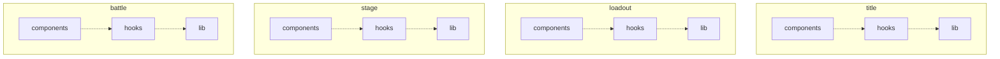

# SKY-1945 — Architecture Handbook

> Generated from `blueprint.config` by `@kekkai/blueprint` — edit the blueprint, not this file.

## Architecture

Code flows one way: each layer may import only from the layers below it. Upstream imports and same-module same-layer imports through the alias are barred.

> **How to read the diagram**: a **solid** edge is a declared importer relation (its label carries the description and/or `selfOnly` — depend on it, never re-export it). A **dotted** edge only records declaration order: adjacent layers are not necessarily related. Reachability is transitive — a layer may import **any** layer below it in the flow, whether or not an edge is drawn, unless the target narrows its importers (`allowedImporters`).

### Modules

| Module | Responsibility | Direct dependencies |
| --- | --- | --- |
| `title` | title screen (§6): logo, breathing prompt, any key or pointer down continues | — |
| `loadout` | loadout screen and allocation (§7, §14.1): the 10-point SPEED / POWER split and the multipliers it yields | — |
| `stage` | play screen (§8–§10, §12.4): viewport fit, entity drawings and placement, speed lines, HUD, overlays, keyboard and pointer controls, touch stick | `battle`, `loadout` |
| `battle` | run rules and simulation (§12, §13): field space, bullets, bursts, player, enemy waves and paths, boss, hit detection, rounds, frame-rate window, and the React adapter of a run | `loadout` |

Every module reuses the shared layer contract below. Module dependencies are transitive: a module may import itself and every downstream module reachable through `dependsOn`; declaration order grants no permission. An absent layer folder is runway.

### Layers

| Layer | Responsibility | Must not | Owns |
| --- | --- | --- | --- |
| `components` | CSS-drawn React elements of the module — screens, craft, bullets, HUD parts | hold simulation rules — they belong in lib | `react` |
| `hooks` | React wiring of the module — frame loop, element measuring, input listeners, per-frame placement | — | `react` |
| `lib` | framework-free rules and data — formulas, schedules, state machines, the matter-js collision adapter | import React | `matter-js` |

## Unit shape

A unit is the code item inside a layer. Folder units expose only their entry; file units are one file each.

| Layer | Unit layout | Entry |
| --- | --- | --- |
| `components` | `folder` | `index` |
| `hooks` | `file` | — |
| `lib` | `file` | — |

## Import discipline

These boundaries are verified alive in the project ESLint run — one blueprint drives both:

- **Module reachability** — a module may import only itself and modules reachable through its declared `dependsOn` edges. The inner layer flow must also allow the import.
- **One-way only** — a layer imports only from the layers below it; upstream imports are errors.
- **Canonical boundary spelling** — use `~app`, the source-root alias, whenever an import crosses a declared layer or module boundary. Additional aliases are resolved for diagnosis, but rejected as alternate boundary spellings.
- **No same-module same-layer imports via the alias** — use a relative path. File units may reach sibling files; folder units may reach a sibling only through its entry. Extract shared logic down to a lower layer when neither unit owns it.
- **Entry-only** — import a folder unit through its `index`, never its internals.
- **Dynamic parity** — a dynamic import whose target reduces to a proven string follows the same alias, flow, and unit-entry rules. Runtime-dependent targets remain explicitly unverified; they are never invented as legal graph dependencies.
- **No redundant relative segments** (`./../`, `././`) that bypass the rules.
- **Ownership** — packages and globals are restricted to their owning layer (see the *Owns* column above).
