# SKY-1945 — Architecture Handbook

> Generated from `blueprint.config` by `@kekkai/blueprint` — edit the blueprint, not this file.

## Architecture

Code flows one way: each layer may import only from the layers below it. Upstream imports and same-module same-layer imports through the alias are barred.

```mermaid
flowchart TD
  m0["app · router composition"]
  subgraph m1["title"]
    m1_l0["components"]
    m1_l1["hooks"]
    m1_l2["contexts"]
    m1_l3["services"]
    m1_l4["models"]
    m1_l0 -.-> m1_l1
    m1_l1 -->|Context only · selfOnly| m1_l2
    m1_l1 --> m1_l3
    m1_l2 --> m1_l3
    m1_l3 -.-> m1_l4
  end
  subgraph m2["loadout"]
    m2_l0["components"]
    m2_l1["hooks"]
    m2_l2["contexts"]
    m2_l3["services"]
    m2_l4["models"]
    m2_l0 -.-> m2_l1
    m2_l1 -->|Context only · selfOnly| m2_l2
    m2_l1 --> m2_l3
    m2_l2 --> m2_l3
    m2_l3 -.-> m2_l4
  end
  subgraph m3["stage"]
    m3_l0["components"]
    m3_l1["hooks"]
    m3_l2["contexts"]
    m3_l3["services"]
    m3_l4["models"]
    m3_l0 -.-> m3_l1
    m3_l1 -->|Context only · selfOnly| m3_l2
    m3_l1 --> m3_l3
    m3_l2 --> m3_l3
    m3_l3 -.-> m3_l4
  end
  subgraph m4["battle"]
    m4_l0["components"]
    m4_l1["hooks"]
    m4_l2["contexts"]
    m4_l3["services"]
    m4_l4["models"]
    m4_l0 -.-> m4_l1
    m4_l1 -->|Context only · selfOnly| m4_l2
    m4_l1 --> m4_l3
    m4_l2 --> m4_l3
    m4_l3 -.-> m4_l4
  end
```

> **How to read the diagram**: a **solid** edge is a declared importer relation (its label carries the description and/or `selfOnly` — depend on it, never re-export it). A **dotted** edge only records declaration order: adjacent layers are not necessarily related. Reachability is transitive — a layer may import **any** layer below it in the flow, whether or not an edge is drawn, unless the target narrows its importers (`allowedImporters`).

### Modules

| Module | Responsibility | Direct dependencies |
| --- | --- | --- |
| `app` | screen flow (§5): switches title → loadout → stage and keeps the allocation across runs | `title`, `loadout`, `stage` |
| `title` | title screen (§6): logo, breathing prompt, any key or pointer down continues | — |
| `loadout` | loadout screen and allocation (§7, §14.1): the 10-point SPEED / POWER split and the multipliers it yields | — |
| `stage` | play screen (§8–§10, §12.4): viewport fit, entity drawings and placement, speed lines, HUD, overlays, keyboard and pointer controls, touch stick | `battle`, `loadout` |
| `battle` | run rules and simulation (§12, §13): field space, bullets, bursts, player, enemy waves and paths, boss, hit detection, rounds, frame-rate window, and the React adapter of a run | `loadout` |

The optional reserved `app` module owns router composition recursively and uses the container position; it does not repeat the shared layers below.

Every other module reuses the shared layer contract below. Module dependencies are transitive: a module may import itself and every downstream module reachable through `dependsOn`; declaration order grants no permission. An absent layer folder is runway.

### Layers

| Layer | Responsibility | Must not | Owns |
| --- | --- | --- | --- |
| `components` | Reusable, presentational UI. | call services; touch the router; own app state | — |
| `hooks` | Adapts server and shared state; the only layer that injects context or owns a store. | — | `react` → `useContext`, `zustand` |
| `contexts` | Defines and provides Context / Provider only. | — | `react` → `createContext` |
| `services` | Network primitives — the only layer that talks to the HTTP client or sockets. | — | `axios`, global `fetch`, global `WebSocket` |
| `models` | Framework-free state models and their rules: formulas, schedules, state machines, the matter-js collision adapter. | import React; touch the DOM outside entity placement | `matter-js` |

## Unit shape

A unit is the code item inside a layer. Folder units expose only their entry; file units are one file each.

| Layer | Unit layout | Entry |
| --- | --- | --- |
| `components` | `folder` | `index` |
| `hooks` | `folder` | `index` |
| `contexts` | `folder` | `index` |
| `services` | `folder` | `index` |
| `models` | `folder` | `index` |

## Import discipline

These boundaries are verified alive in the project ESLint run — one blueprint drives both:

- **Module reachability** — a module may import only itself and modules reachable through its declared `dependsOn` edges. The inner layer flow must also allow the import.
- **One-way only** — a layer imports only from the layers below it; upstream imports are errors.
- **Canonical boundary spelling** — use `~app`, the source-root alias, whenever an import crosses a declared layer or module boundary. Additional aliases are resolved for diagnosis, but rejected as alternate boundary spellings.
- **No same-module same-layer imports via the alias** — use a relative path. File units may reach sibling files; folder units may reach a sibling only through its entry. Extract shared logic down to a lower layer when neither unit owns it.
- **Entry-only** — import a folder unit through its `index`, never its internals.
- **Dynamic parity** — a dynamic import whose target reduces to a proven string follows the same alias, flow, and unit-entry rules. Runtime-dependent targets remain explicitly unverified; they are never invented as legal graph dependencies.
- **No redundant relative segments** (`./../`, `././`) that bypass the rules.
- **Ownership** — packages and globals are restricted to their owning layer (see the *Owns* column above).
- **selfOnly** — where a layer narrows its importers with `selfOnly`, that importer may depend on it but must never re-export it onward.

## Component shape — 7 orthogonal axes

A set, not a pipeline: each axis is an independent yes/no design decision — never infer
that one axis holds because another does. Numbering is identity, not order, and trivial
changes need not force the full pass. Lint is an entry point here, never a verdict.

### 1. Ownership Inversion — The unit that needs derived state owns the derivation.

Do not precompute in the parent and drill the result down — the child imports the hook and derives it itself. Field-tested: 17 props down to 7.

### 2. IO Shrinkage — Narrow the inputs, shrink the outputs.

Three moves: split a multi-concern unit; collapse parallel raw states carrying an invariant into one modeled state; merge symmetric twins into one object of the same shape. Count and size are weak signals — whether the state is modeled is the review call.

> Triage: `max-params` is the review entry point — the verdict stays with review.

### 3. SRP Decomposition — Split on responsibility boundaries, not on size.

Naming test: if you cannot name it without "and", it wants splitting; dissolving code into an existing home is also a split. Exception: writable state that must stay in sync — force-splitting it manufactures sync bugs.

> Triage: `max-statements` is the review entry point — the verdict stays with review.

### 4. Orchestration Shell — A page only orchestrates.

Route/id resolution, the loading shell, shared sources, cross-child lifecycle — never deriving values on behalf of each child. Field-tested: a 6666-line detail page down to 552.

> Triage: `max-lines` is the review entry point — the verdict stays with review.

### 5. Scoped Writable State — Writable state lives at the lowest common owner of its writers and readers.

Hoist only what is genuinely shared across a boundary; state that must survive a route change goes to the URL or a store. "Might be shared later" is YAGNI — hoist when the sharing arrives.

### 6. Lifecycle Internalization — If lifecycle is part of the responsibility, build it in.

The caller receives a unit that is already running and cleans itself up — not a kit of handlers to wire into mount/effect hooks. Field-tested: 19 exports down to a one-line call.

### 7. Pure Helpers ≠ Composables — Keep pure functions out of reactive/lifecycle units.

One exported function does not demand one file: responsibility splits at the function level; the file splits only when max-lines approaches. Expose the decision a unit makes, not its raw ingredients.

## Principles

### Behavioral (held in review / CLAUDE.md)

- **Split by responsibility, not by size** — The signal to split is how many things a unit does — line count is only a backstop.
- **One source of truth** — Derive computed values; never store duplicate mutable state that can desync.
- **Keep interfaces narrow** — Narrow inputs and outputs so illegal states cannot be expressed.
- **Keep knowledge where it is used** — Push derivation to the child and state to its lowest common owner; do not hoist.
- **Dead code: delete it or mark it** — An abstraction with no consumer is dead; sweep orphans, mark retained-dead as deprecated.
- **Lint is an entry point, not a verdict** — Mechanical checks only triage; cohesion and invariants need review.
- **Acceptance criteria are a start, not scripture** — Fixing a ticket that violates an abstraction's responsibility is upholding the design.
- **YAGNI — do not over-engineer** — "Might need it later" is not a reason to abstract now.
- **Cost is the third dimension** — Cost = work per event × event frequency; price any logic wired to a data source.

## Working playbook

Judgment rules no tool enforces — they hold in review and in the agent contract.

### Runtime load discipline

- **Price every handler attached to a data source.** — Before wiring anything to WS / polling / scroll / input, answer: events per second, data per event, per-event cost. If you cannot answer, it does not merge — and copying an existing pattern is no exemption, because frequency is not in the code.
- **High-frequency updates write in place.** — Patch the changed entry and keep container identity; whole-replace is for baseline rebuilds only. A prop whose identity changed while its value did not is the disease. Write shapes do not port across frameworks.
- **Diagnose re-renders in four steps, never by guessing.** — Who renders (profiler) → what triggered it (render tracing) → who produced the identity (grep the assignment sites) → was it worth it (compare against the event payload).
- **Performance claims must be acceptance-testable.** — "Fewer re-renders" is not a claim; "one event re-renders at most N components" is. Pin it with a render-count or identity-stability test — an unmeasured performance claim did not happen.

### Refactor discipline

- **Safety net first, then split, then tidy the tests.** — Three stages, one commit each, non-overlapping review scopes. Writing the net first forces the observable contract into the open.
- **One refactor arc = one PR, one commit per phase.** — The PR body maps each commit to its phase; ask before splitting the arc into separate tickets.
- **Extract by copying from source, never by rewriting from memory.** — After extraction, diff the target against git history — a passing suite alone does not prove the extraction faithful.
- **Scan every identifier before extracting.** — Not just reactive refs — imports, local definitions, parameters. A missed dependency surfaces later as a broken extraction.
- **Do not pin what the refactor itself will change.** — A safety net asserting values the arc is about to change fails the moment the sibling refactor lands.
- **AC-named payload fields deserve a contract test.** — Asserting that the mocked service receives field X is not a tautology — a dropped field or an unbound handler breaks it while the source constant stays green.
- **Wrap an arc with cross-cutting themes and verified numbers.** — Name the forces (ownership inversion, IO shrinkage, SRP) and attach before/after numbers verified against git history.

### Design collaboration

- **Frame architectural corrections as guarding the design.** — State the principle being protected, show how the literal ticket reading violates it, and present the choice as that principle's natural consequence.
- **Do not reopen settled designs.** — When the shape has been specified, implement it as spec. Raise genuine concerns once, with reasons — not as a menu of alternatives.
- **"The user can work around it" does not park a bug.** — Judge by diff size, scope, and standalone impact; a normal-path bug that violates expectations deserves its ticket.

## Rules

| Rule | Tier | Option | Enforced by |
| --- | --- | --- | --- |
| `maxLines` | `error` | `400` | lint |
| `maxLinesPerFunction` | `warn` | `100` | lint |
| `maxParams` | `warn` | `3` | lint |
| `maxStatements` | `warn` | `15` | lint |
| `complexity` | `warn` | `12` | lint |
| `unusedVars` | `error` | — | lint |
| `explicitAny` | `error` | — | lint |
| `codeStyle` | `error` | — | lint |
| `statementsPerLine` | `error` | — | lint |
| `statementPadding` | `error` | — | lint |
| `importBlock` | `error` | — | lint |
| `fixtureImports` | `error` | — | lint |
| `cycles` | `error` | — | `blueprint inspect` |
| `deadCode` | `error` | — | documentation only |
| `usePrefix` | `error` | — | lint |
| `testFilename` | `error` | — | lint |
| `usePrefixReactivity` | `warn` | — | lint |
| `typedefOnlyFile` | `warn` | — | lint |

The tier is what the enforcing machine does with a violation: `error` fails, `warn` is advisory, `off` is disabled. Which machine differs — `lint` rows fail the project's lint run, `blueprint inspect` rows fail `blueprint inspect` and never appear in a lint run, documentation-only rows are recorded intent with no gate behind them at any tier, and a row reading `nothing` is lint-gated in general but cannot emit on THIS blueprint — the cell says which fact rules it out. Every row reaches only the files the architecture globs match: a declared position holding no code has nothing that can fail, which is runway rather than protection — `blueprint doctor` reports which of the two this repo has today.

## Naming

| Concept | Convention |
| --- | --- |
| `component` | PascalCase; the implementation file is named after the unit |
| `hook` | useX — only when it genuinely uses reactivity |
| `service` | snake_case |
| `context` | XxxProvider / XxxContext |
